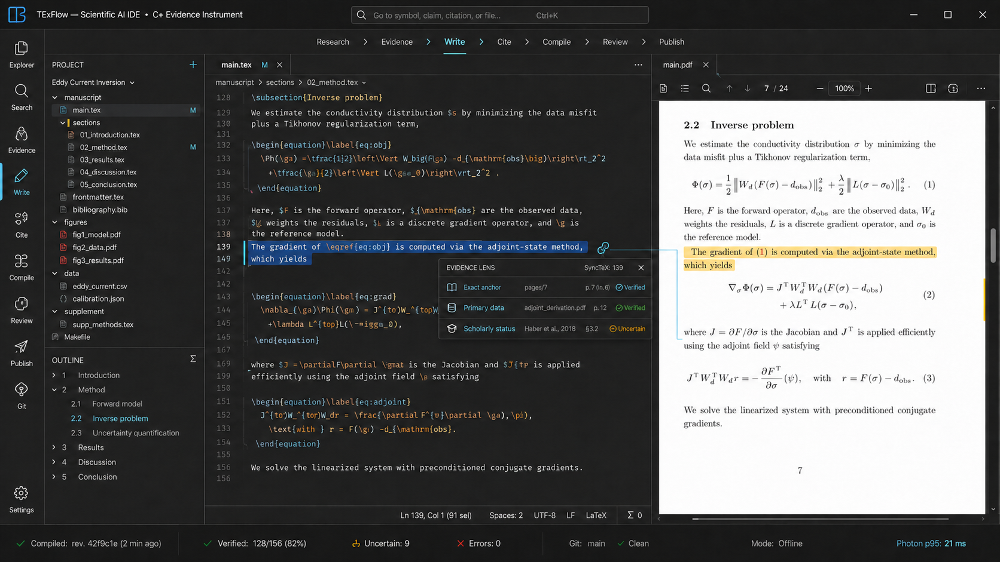

# TExFlow Zig Scientific AI IDE Design

| Field | Decision |
| --- | --- |
| Status | Previously approved system design reopened for the latest isolation, identity, Unicode, search, and licensing corrections; T0.1 complete; T0.2 plan under adversarial review; T0.2 implementation has not started |
| Decision date | 2026-09-03 |
| Product identity | `TExFlow`; repository lineage remains `github.com/ndak79/Oleafly` only as source history |
| Original repository baseline | `2b389eaf7379531e661fabbce22918b123c805ea` |
| Current implementation baseline | T0.1 evidence commit `4898f33c88ca93e95295d2da5c4ffa367b90a8d6` |
| Target | Windows-first native desktop application |
| Product source of truth | Plain-folder LaTeX source, with `.tex` authoritative |
| Product loop | Research -> Evidence -> Write -> Cite -> Compile -> Review -> Publish |
| Publishing boundary | PDF, LaTeX source package, and EPUB |
| Architecture label | C+ event-driven native instrument |

This document records the four approved design checkpoints for rewriting
TExFlow. It is a design contract, not a claim that the rewrite already exists.
The legacy React, TypeScript, Tauri, and Rust application remains the behavioral
comparison oracle until a verified Zig slice replaces each journey. It is not
normative: this specification, explicit acceptance criteria, and user intent
override legacy bugs, accidental behavior, and removed scope.

`C+` is only the name of the selected architecture option. It does not mean
that TExFlow will be implemented in C++. TExFlow-owned executable logic is Zig.
Reviewed C or C++ libraries may be linked as native dependencies, and reviewed
external tools may run out of process.

The canonical product/display name and publisher-facing executable stem are
exactly `TExFlow`. Shipping PE files are `TExFlow.exe`,
`TExFlow.PdfWorker.exe`, and `TExFlow.ScienceWorker.exe`; later role images use
the same `TExFlow.<Role>Worker.exe` grammar. Machine-facing protocol/hash/ETW
and plain-folder metadata namespaces use lowercase ASCII `texflow` (including
`.texflow/`) so case folding is deterministic. `Oleafly` may appear only in the
historical repository URL, frozen unshipped legacy-oracle sources/documents,
explicitly inventoried migration identifiers, legally required source-lineage
attribution/notice text, and pre-rename audit paths; it is never a
new window title, binary, package identity, data root, telemetry provider,
protocol domain, or user-facing product string. The legacy tree remains a
read-only comparison input during staged replacement and is excluded from every
TExFlow install/package inventory. T0.2c retires the installed
`oleafly-t0.1` console artifact, preserves its toolchain-smoke intent as a
test-only Zig gate under the lowercase `texflow` test namespace, and renames the
internal T0.1 ABI/header/symbol namespace to `texflow`; no legacy-named PE or
compatibility alias is installed or shipped because T0.1 has no external ABI
consumer.

Windows identity is equally exact. The main window title and `ProductName` are
`TExFlow`. PE `OriginalFilename` values match the three filenames above;
`InternalName` values are `TExFlow`, `TExFlow.PdfWorker`, and
`TExFlow.ScienceWorker`; worker `FileDescription` values are `TExFlow PDF
Worker` and `TExFlow Science Worker`. The UI description is `TExFlow`. The
machine-facing main-window class is `texflow.main.v1`. T0.2 embeds no invented
legal `CompanyName`, copyright owner, signer, or MSIX publisher; those remain a
T5.2 owner-supplied release input. The two LPAC profile monikers are exactly
`texflow.pdfworker.v1` and `texflow.scienceworker.v1`; they must derive distinct
expected package SIDs. Changing a moniker/version is a security-boundary change
that requires an ACL/profile migration review, not an automatic rename.

T0.2 PE metadata is explicitly non-release identity, not an empty or misleading
version. All three feasibility images use numeric `FILEVERSION` and
`PRODUCTVERSION` `0,0,2,0`, strings `FileVersion=0.0.2.0` and
`ProductVersion=0.0.2-feasibility`, `VS_FF_PRERELEASE | VS_FF_PRIVATEBUILD`,
`VOS_NT_WINDOWS32`, `VFT_APP`, `PrivateBuild=T0.2 architecture feasibility;
not release-qualified`, and Unicode English translation `040904B0`. T5.2
replaces this whole version tuple only from an owner-approved release contract;
it cannot silently retain the feasibility flags or infer a legal publisher.

The legacy green-leaf Oleafly icon does not ship under the new identity.
TExFlow uses a compact source-to-evidence flow mark: an open paper/bracket form,
one continuous teal flow stroke, and one evidence node on deep graphite/paper
surfaces, with no wordmark or ornamental gradient inside the icon. A reviewed
master and multi-resolution Windows ICO must remain recognizable at 16, 24, 32,
48, and 256 pixels, preserve alpha/padding, and be checked in Explorer, the
system title bar, Alt-Tab, and the taskbar across light/dark/high-contrast
contexts. Only the UI PE carries this icon; headless workers carry role metadata
without duplicating UI art.



_Visual direction, not a runtime screenshot. Section 4 contains the
authoritative performance gates._

## 1. Executive decision

TExFlow will become a focused Scientific AI IDE for research writing rather
than a general publishing suite. The application will be a native Windows
desktop program built in Zig with direct Win32, D3D11, DXGI, Direct2D,
DirectWrite, DWM, UI Automation, and Windows process APIs. It will not ship a
browser engine, WebView2 dependency, React runtime, Tauri runtime, Rust-owned
service, or Windows App SDK runtime.

The selected design is intentionally event driven:

- the GPU presents only after observable state changes;
- the UI thread never performs filesystem, database, compiler, network, or
  model work;
- each mutable subsystem has one owner;
- scientific truth is stored separately from disposable indexes;
- PDF, compiler, parser, and intelligence work is bounded and isolated;
- expensive capabilities load only when first used;
- the interface changes its arrangement for the scientific task instead of
  keeping every panel open.

The architecture was compared with the original native option, a fully custom
GPU editor, WinUI 3, Qt 6, Slint, and a WebView/Tauri design. The weighted
comparison and challenger review retained C+ as the leader. Earlier exploratory
point scores and Monte Carlo counts are intentionally not repeated as evidence
because their complete input matrix and seed were not preserved in the
repository. This removes false precision: only the dated review log and Train
T0 runtime evidence can support the choice. Train T0 can reject the architecture
if measured behavior does not satisfy the gates in this document.

## 2. Product laws

These rules are invariant across every implementation slice.

1. `.tex` is the source of truth. A visual representation, PDF, index, model
   answer, checkpoint, or database projection never silently replaces source.
2. A project is a normal folder. Open Folder works directly without import or
   conversion into a private document format.
3. Local authoring, evidence inspection, compilation through an installed
   toolchain, Git, checkpoints, and publishing remain useful without an AI
   account or network connection.
4. Model output is an untrusted proposal. It becomes source only through a
   visible diff and explicit accept action against the exact base revision.
5. Scientific verification reports what is known, unknown, stale, conflicting,
   or unverifiable. It never converts a confidence score into a verified fact.
6. Optional capability must not tax startup, idle memory, input latency, or
   privacy when it is not enabled.
7. Automatic checkpoints are recovery records, not hidden Git commits. Git
   history changes only through an explicit user action.
8. EPUB remains a publishing target, but EPUB requirements do not expand the
   core into a general-purpose book or layout application.
9. Accessibility, low-end hardware, RDP, high contrast, and device-loss paths
   are release contracts rather than later polish.
10. A slice is complete only after one full closed-coverage QA pass, run after
    the last medium-or-higher repair, contains no open or newly discovered
    medium-or-higher finding.
11. Network, account-backed, paid, or credentialed capabilities start disabled.
    Enabling one requires an explicit provider configuration and a disclosure
    decision; local functionality never depends on that decision.

## 3. Scope

### 3.1 Core authoring

- Open Folder and recent workspaces
- LaTeX source editing
- TexLab through LSP
- multi-file project discovery, outline, labels, includes, and root selection
- structured compile diagnostics
- PDF preview
- bidirectional SyncTeX
- Tectonic, with latexmk and TeX Live or MiKTeX compatibility fallback
- `.bib` parsing and citation picker
- Git operations
- automatic recovery checkpoints
- immutable AI patch, accept, reject, and rollback
- MCP and external-agent integration

### 3.2 Scientific research

- Zotero Local API and Better BibTeX JSON-RPC integration
- arXiv, Semantic Scholar, Crossref, PubMed, and OpenAlex search
- local PDF paper library and full-text index
- Work, Expression, Manifestation, and Artifact identity model
- claim-evidence-argument graph
- exact evidence anchors and citation verification
- literature review workspace
- consistency, methodology, experiment, and statistics audits
- Reviewer 2 simulation with explicit model provenance
- rebuttal workspace linked to reviewer comments, evidence, and source diffs
- Scientific Submission Preflight
- source-first scientific figure and TikZ workspace

Scientific computation in the core does not embed Python, R, JavaScript, or a
notebook runtime. A future domain adapter may invoke a separately installed tool
through the same declared-snapshot, consent, process, provenance, and receipt
boundary as other external tools; adding one is a new reviewed slice rather than
an implicit exception to the all-Zig policy.

### 3.3 Publishing

- accepted compiler PDF
- deterministic LaTeX source package
- EPUB
- RO-Crate 1.3 research package metadata where requested
- Word import as an optional utility through the Pandoc pack

### 3.4 Removed from the core

- Typst and Markdown project engines; the rewritten authoring source model is
  LaTeX, while Pandoc may use intermediate formats inside a publishing worker
- resume and ATS workflows
- generic presentation creation
- PowerPoint export
- book, letter, resume, and generic template ecosystems
- generic drawing canvas
- conference-deadline browser
- full WYSIWYG LaTeX
- a home-grown generic autonomous-agent framework

Small scientific starter projects and journal submission profiles may remain
as versioned data packs. They do not recreate the generic template ecosystem.

Existing behavior in these removed areas may be retained as fixtures only when
it helps prove that an unrelated retained journey has not regressed. It must
not survive in the production dependency graph after cutover.

## 4. Measurable product contract

### 4.1 Reference environments

Every performance release gate runs on both of these Windows machines:

- low tier: 4 physical CPU cores, 8 GiB RAM, integrated GPU, SSD;
- mainstream: current 6-8 physical CPU cores, 16 GiB RAM, integrated or
  entry discrete GPU, SSD.

T0.2, before the first measured native campaign, freezes the exact CPU and GPU models, firmware and driver revisions,
memory configuration, storage model and free-space floor, display path, cooling
policy, and AC/battery state for both reference machines. A replacement machine
must first pass a recorded equivalence calibration against the retired one;
quietly upgrading hardware cannot make a regression disappear.

The functional compatibility floor is x64 Windows 10 22H2 build 19045, with
solid, WARP, and non-Mica fallbacks. Because ordinary Windows 10 support ended
on 2025-10-14, it is a release-supported security lane only on an edition and
device receiving Microsoft Extended Security Updates. The primary supported
lane is the latest generally available, servicing-supported x64 Windows 11
release frozen by T0.2 before its first native campaign; as of this decision it
is Windows 11 25H2. An older OS
may remain technically compatible, but TExFlow does not label an unserviced OS
as secure or supported.

APIs are resolved by capability rather than an obsolete Windows-version check.
T0.2 records the exact minimum build and servicing evidence used by the native
feasibility candidate; T5.2 freezes the package support matrix and every release
refreshes that evidence before signing. macOS,
Linux, native ARM64, and Windows on ARM performance are outside this rewrite;
adding any of them requires a separate design and benchmark decision.

The matrix covers the Windows 10 compatibility/ESU lane and supported Windows
11 lane on both frozen reference machines, 1920x1080/2560x1440/3840x2160,
60/120/144 Hz, 100/150/200 percent DPI, hardware rendering, WARP, clean and
established profiles, and RDP. It is a predeclared constrained mixed-strength
matrix rather than an undocumented Cartesian sample: every pair of declared
factors is covered, display/renderer/OS risk groups receive three-way coverage,
and fixed worst-case cells are added explicitly. A repository-owned Zig
generator and verifier materialize the rows and prove coverage before any
measurement; rows cannot be deleted after results are seen. Thirty-trial
performance distributions belong to named benchmark cells and profile strata,
not to a pooled grab bag of matrix rows. Results never pool different machine,
OS, renderer, profile, power, or RDP strata to pass a budget.

Interaction metrics report p50, p95, p99, worst, dropped presentation ratio,
intentional coalescing, refresh rate, present mode, and trace-loss count. A mean
alone, a trace with lost events, an undeclared replacement trial, or an
aggregate whose constituent stratum fails is not release evidence.

Local-display photon gates apply to the physical-display rows. RDP cannot be
given the same absolute photon promise because network, client display, and
codec latency are outside the process. Its controlled lane records RTT, codec,
client refresh, host and client builds, then requires the same host-side input
and state-mutation gates, zero app polling, no lost current state, and no more
than one additional refresh period of app-attributable latency relative to a
native text-control reference in the same session. End-to-end RDP latency is
reported, not silently compared with a local-display threshold.

### 4.2 Release budgets

| Metric | Gate |
| --- | --- |
| Core installer, excluding optional packs | <= 30 MiB |
| Installed core footprint, excluding optional packs and user data | <= 90 MiB |
| Cold interactive start p95 | <= 400 ms |
| Warm interactive start p95 | <= 150 ms |
| Empty-shell aggregate private working set | <= 45 MiB |
| Empty-shell idle private commit | <= 55 MiB |
| Aggregate private working set with a 30-page PDF open | <= 100 MiB |
| Private commit with a 30-page PDF open | <= 120 MiB |
| Aggregate private working set/private commit during the frozen 10,000-entity search workload | <= 110 MiB / <= 135 MiB |
| First-use lexical search over an existing generation, p95 | <= 400 ms from command activation with no science-worker process or open search connection to the first `min(8, H)` broker-proven identity/title rows, or the terminal honest empty state when `H=0` |
| Warm lexical query, p95 | <= 75 ms from submission with a ready worker/open database and no cached result for that query to the first `min(8, H)` broker-proven identity/title rows, or the terminal honest empty state when `H=0` |
| Broker-validated search snippets, p95 | <= 200 ms for the first `min(8, H)` representative snippets and <= 750 ms for the explicit four-MiB adversarial entity; with no UI-thread slice above 4 ms |
| Obsolete search-query or rebuild cancellation acknowledgement | <= 50 ms on the non-faulting corpus, with zero stale row/snippet attached to the new query and no cancelled staging generation activated |
| Disposable search storage over the frozen 128-MiB canonical corpus | Quiescent active generation <= 192 MiB logical and allocated bytes; empty-root rebuild peak <= 224 MiB; at most one active plus one staging generation and <= 400 MiB for the complete derived root; complete rebuild p95 <= 30 s and never blocks the UI STA |
| App-owned committed GPU bytes | <= `3P + T + 16 MiB`, where `P` is one RGBA viewport and `T` is the active PDF tile limit or zero |
| Cached editor input to source-mutation acknowledgement p95 | <= 4 ms |
| Dirty shell/PDF state to app frame submission p95 | <= 4 ms |
| All-input to photon p95, editor and app-compositor lanes | <= `min(25 ms, 2R)`, where `R` is one refresh period |
| Dropped presentations during a 10,000-edit trace | <= 0.1 percent |
| Empty-shell idle CPU after quiescence | <= 0.5 percent of one logical processor |
| Fixed render, polling, or editor-child wake timers while minimized/fully occluded after quiescence | zero |
| Live-render scheduling delay in Auto mode | adaptive 220-750 ms |
| Superseded compiler grace before cancellation | 75 ms |
| Visible stale artifact presented as current | zero |

For each frozen search query, `H = min(100, expected_match_count)` comes from
the independent canonical-corpus oracle, never from the worker reply. A missing,
extra, duplicated, or misordered expected result fails correctness and its
latency sample; returning fewer rows cannot create a fast pass. The 0/1/10/100/
greater-than-100-hit, 64-term, and four-MiB adversarial classes are evaluated
separately rather than pooled. Warm search permits the already open SQLite/OS
caches but clears TExFlow result and presentation caches for the selected query;
first-use search starts with the UI already interactive, no science-worker
process, and no open search connection. The quiescent storage endpoint follows
a committed rebuild, FTS integrity check, successful truncating WAL checkpoint,
statement finalization, and clean connection close, with no staging generation.
It recursively counts both logical file length and allocated bytes for every
database, WAL, SHM, journal, manifest, pointer, temporary, and residue file;
compression, sparse allocation, or an omitted sidecar cannot manufacture a
pass.

The former idea of an 8 ms input-to-screen gate is rejected. A 60 Hz display
has a 16.67 ms refresh period, so that number would be physically dishonest.
TExFlow measures input QPC, state mutation, layout, frame submission, present,
display, and photon-oriented latency separately. The Scintilla child HWND and
the app-owned DXGI swap chain are separate measurement lanes; a fast shell
present cannot hide a stale editor glyph. TraceLogging and ETW provide
application events; PresentMon supplies per-presentation metrics such as
`MsUntilDisplayed` and `MsAllInputToPhotonLatency` for supported modes.

Every trace correlates process, thread, HWND or swap chain, input sequence,
state hash, present ID, and display event. `NA`, ambiguous cross-window
correlation, or a lost GDI/DWM/RDP event is missing evidence, never zero latency.
T0 validates PresentMon against a timestamped visual-toggle fixture for both
lanes. Where a presentation mode cannot be correlated reliably, the release
matrix uses WPR/DWM evidence plus a calibrated high-speed-camera or latency
instrument run rather than borrowing the DXGI result.

Cross-process QA correlation has one non-authoritative input:
`--trace-trial=<32 lowercase hexadecimal digits>`. It changes only local ETW/log
correlation IDs, never fixtures, security policy, timing behavior, or acceptance
logic. The UI rejects duplicate/malformed values before opening a window; when
the option is absent it generates 128 random bits with the Windows CSPRNG. A
worker receives the same 16 bytes only inside its authenticated bootstrap and
echoes them in its first event. The harness must match nonce, PID/creation time,
role, and the exact 32-byte build identity defined below. Knowing or choosing
the nonce grants no test mode or authority. For an admitted campaign, all
TExFlow role images embed the same
32-byte build identity:

`SHA-256("texflow:build:v1\0" || source_set_sha256[32] || dependency_lock_sha256[32])`.

`source_set_sha256` is SHA-256 over domain
`texflow:source-set:v2\0`, `entry_count_u64_le`, then every staged tracked entry
except `docs/superpowers/evidence/**`, sorted by canonical UTF-8 slash path and
encoded as `path_length_u32_le || path_bytes || mode_ascii[6] ||
content_length_u64_le || blob_sha256[32]`. `blob_sha256` hashes the exact raw Git
blob payload bytes, without the Git object header; the outer identity therefore
does not inherit the collision strength of this repository's SHA-1 object name.
The verifier consumes NUL-delimited index records, requires Git object format
`sha1`, stage zero, modes exactly `100644` or `100755`, valid nonempty UTF-8
relative paths using `/`, and no Windows-reserved, ADS, dot-segment,
case-insensitive, or NFC-colliding path. It exports raw blob bytes without
checkout line-ending conversion, revalidates every Git blob ID, byte length,
and raw-content SHA-256; symlink, submodule, sparse-placeholder, unmerged,
duplicate, or missing records fail.
The Zig controller resolves one canonical absolute Git executable and records
its version and SHA-256. With system/global configuration, repository discovery,
replace objects, lazy fetch, alternates, filters, text conversion, pagers,
tracing, and ambient Git path variables disabled, it acquires the repository's
conventional index lock, captures exact full-OID `ls-files --cached --stage
--full-name -z` output, exports only those full object IDs through raw
`cat-file --batch`, and captures the index listing again. Both listings must be
byte-identical. Zig independently recomputes each current-format Git blob OID
over `"blob " || decimal_length || NUL || raw_bytes` as well as the v2
raw-content SHA-256 and length before releasing the lock. Post-push proof uses
the exact full commit with recursive NUL-delimited `ls-tree --full-tree`, not a
mutable index or checkout, and must produce the identical v2 entry stream.
`dependency_lock_sha256` is SHA-256 over the raw repository bytes of
`tools/zig/native-deps.json` in that source set. That lock includes the exact
admitted target triple, baseline CPU model/features, `ReleaseSafe` optimization,
installed-image strip/subsystem policy, role feature switches, Zig/toolchain
identity, and native dependency closure; host-native CPU selection is forbidden.
A Zig-owned pre-build verifier
exports exactly that source set to a clean temporary root and rejects malformed
entries, an exported-input mismatch, a build/packaging/QA dependency on the
excluded evidence namespace, a mutated dependency lock, or unequal embedded
identities before launch. This permits evidence to be written after the required
pre-commit QA without inventing a future commit or changing measured build
inputs. After push, evidence recomputes the source-set digest from the resulting
commit; a mismatch reopens the candidate. The role remains a separate
authenticated field so a shared build identity cannot authorize role
substitution.

The common build identity is a source/configuration identity, not a digest of
the resulting executable. Before an admitted T0.2 campaign, the Zig
reproducibility controller must produce two byte-identical complete install
payloads and one canonical `path/type/size/SHA-256` manifest. Its digest, every
role PE digest, and the common build identity form a generated candidate
receipt. The campaign uses one of those exact read-only payloads, rehashes the
complete root before every named cell, and matches each process image/file ID
and loaded-module receipt after launch. Any replacement, extra/missing file,
receipt disagreement, or same-build-identity/different-binary case invalidates
the cell. The receipt is generated output retained with evidence; it never
changes product bytes, source-set membership, fixtures, thresholds, or verdict
logic.

T0.2 measurements use this explicitly unsigned, prerelease `ReleaseSafe`
feasibility candidate; they are not mislabeled as signed-package evidence.
Later release qualification uses the signed, packaged `ReleaseSafe` binary and
a versioned fixture set. ETW process start is time zero. "Interactive" means the
first non-placeholder shell and editor frame has been displayed and a harness
keystroke can mutate the source model; a splash, empty swap chain, or merely
created HWND does not qualify. A warm trial starts after one unmeasured priming
launch, full process termination, and five seconds of quiescence while OS caches
remain intact. Each cold trial follows an independent clean boot with no prior
TExFlow launch. Cold and warm distributions each contain 30 trials per reference
machine. OS build, power plan, battery state, Defender state, driver versions,
DPI, display mode, and signer are recorded.

Both the signed MSIX-installed and signature-verified portable distributions
run the gate; the slower result governs. Trials cover a clean user profile and
an established profile reopening a versioned multi-file workspace. Workspace
discovery may continue asynchronously after the interactive point, but restored
source text, selection, and commands shown at that point must already be real
and usable.

Memory is sampled after five minutes of an unchanged visible shell and again
over a ten-minute window. Gates aggregate private working set and private commit
across the entire TExFlow-owned process tree, so moving work into a worker cannot
hide it; shared pages and GPU allocations are reported separately. The harness
also records peak commit, handles, threads, and worker processes. Explicit
working-set trimming or preloading is forbidden. Installer size is not allowed
to hide expansion, which is why installed footprint is a separate gate.

GPU accounting records committed and resident app-owned allocations by heap and
resource. The formula above permits the two-buffer swap chain, at most one
viewport-sized intermediate, bounded PDF tiles, and 16 MiB of other app-owned
graphics resources. DWM and driver allocations are reported separately because
the process cannot own their policy, but a T0 comparison still rejects an
architecture that creates disproportionate redirected-surface cost.

The 10,000-edit trace contains paced typing, bursts, IME composition, selection,
scroll, undo, diagnostics, and live-render completions. Each intended visible
state has an ID and content hash. Coalescing before the next eligible frame is
recorded but is not a drop; a scheduled state that misses its declared display
deadline without occlusion, device loss, or a newer superseding state is a drop.
The denominator, superseded-state count, and every exclusion are emitted with
the trace so the ratio cannot be improved by silently discarding samples.

### 4.3 Energy contract

- Foreground interaction uses normal or high quality of service only while
  necessary to satisfy input latency.
- Indexing, embedding, and maintenance work uses EcoQoS and low memory
  priority when the platform supports it.
- Minimized or fully occluded windows do not wake for fixed rendering,
  animation, indexing, status polling, or editor-child work. The timer inventory
  includes Scintilla's caret, dwell, scroll, widen, and idle-styling tickers, not
  only timers created by TExFlow.
- A visible, focused Scintilla caret may use the current Windows system blink
  period; that expected wake is recorded separately and is not mislabeled as
  application polling. On minimized or fully occluded transition, TExFlow
  disables caret blink, dwell, and idle styling and cancels or boundedly drains
  pending scroll/widen/idle work. It restores the exact visible-state settings
  without losing focus, selection, IME composition, or pending edits. After the
  declared occluded quiescence point, no such periodic timer may wake.
- Compilation may continue while occluded only when the user requested it or
  an active publish operation depends on it.
- Empty-shell CPU is measured after the quiescence point above. Background work
  must expose its reason, deadline, QoS, cancellation state, and completion; an
  idle budget cannot be met by deferring an unbounded queue until later.

## 5. Shipped-code policy

### 5.1 What "all Zig" means

All new TExFlow-owned runtime logic, worker logic, CLI behavior, migrations,
protocol adapters, parsers written by the project, benchmark harnesses, and
native UI automation harnesses are Zig. After cutover, the shipped application
contains no TExFlow-owned TypeScript, JavaScript, Rust, C#, or C++ executable
logic.

No embedded general-purpose scripting runtime is part of the core. External
scientific or publishing tools remain separate processes with typed adapters;
their executable bytes, versions, inputs, outputs, and authority are visible in
the resulting receipt.

Declarative assets are not executable-language exceptions. The repository may
contain GitHub Actions YAML, MSIX XML, Windows resources, JSON/TOML schemas,
icons, test fixtures, licenses, and documentation. Reviewed upstream native
libraries and external tools are also not rewritten merely to satisfy a label.

The shipped Zig build defaults to `ReleaseSafe`. Process-wide runtime-safety
removal is prohibited. A scoped unchecked hot loop is eligible only after a
reproducible benchmark proves material need and property, fuzz, sanitizer, and
differential tests cover its complete input domain; it is never allowed in
path, archive, protocol, persistence, authorization, or untrusted-input
decoding code. The evidence manifest names every approved exception.

### 5.2 Native dependency candidates

| Capability | Candidate | Boundary |
| --- | --- | --- |
| Source editor | Scintilla 5.6.6 plus a TExFlow-owned Zig LaTeX/BibTeX container lexer | UI-image-only native C++ editing core through the upstream status-returning direct interface; styling through bounded Zig `SCN_STYLENEEDED` handling; Scintilla is absent from every worker image, and Lexilla 5.5.3 is test-only comparison evidence that is not shipped |
| PDF | PDFium 154.0.8035.0 (`chromium/8035`) feasibility pin | Public C ABI, no V8/XFA, isolated single-engine-thread worker |
| Database and full-text search | SQLite 3.53.4 or newer reviewed patch release | Pinned amalgamation, FTS5 enabled |
| Graphics | D3D11, DXGI, Direct2D, DirectWrite, DWM | Windows system APIs |
| Accessibility | UI Automation and Text Services Framework | Windows system APIs |

Candidate versions are frozen only after Train T0 reproduces their source,
license, ABI, binary size, security, and performance evidence. Dependency
archives and generated binaries are checksum pinned. Dynamic libraries load
only by absolute path with the appropriate `LOAD_LIBRARY_SEARCH_*` policy and
verified hash or signature.

The PDF candidate changed after approval because source-level review found a
hard all-Zig boundary violation in the original MuPDF proposal. MuPDF's serious
operations require its `fz_try`/`fz_catch` macros, whose `setjmp`/`longjmp`
control flow cannot safely cross Zig stack frames without a TExFlow-owned C
bridge. Process isolation contains a crash but cannot make an unguarded call a
valid error boundary. PDFium is the replacement candidate because its upstream
public C ABI exposes the required render, text, search, character geometry,
link, annotation, and progressive-pause surface without an owned non-Zig shim.
T0.2 must still reject it unless exact official root commit
`6f2272e1f3aaa141305475b83ef4eac2c1f527b8` and its resolved source graph can be
independently reconstructed, statically matched to the provenance-checked
reference's ABI/enabled surface, and shown to pass independent correctness,
resource, and performance oracles. The community binary is reference evidence only: no admitted T0.2
worker may load it after reconstruction. Runtime/security probes use the sealed
reconstructed artifact and record its digest. That artifact is still not
release-qualified; the shipping DLL requires a later protected
TExFlow-controlled build, repeat equivalence/security evidence, and Authenticode
signing. This paragraph is the 2026-09-04 PDF-engine ADR and supersedes the
original candidate wherever historical review evidence names MuPDF.

No PDFium DLL executes during acquisition, source reconstruction, or static ABI
audit. T0.2 first launches a Zig-only dummy role and proves an imperatively
created Less Privileged AppContainer (LPAC) with zero named capabilities, the
`ALL APPLICATION PACKAGES` opt-out, Job, peer identity, handle allowlist,
sealed runtime, and negative access probes. Only then may a fresh LPAC worker
load the sealed source-reconstructed artifact. The community reference DLL is
never executed; runtime correctness is judged against independently generated
semantic/pixel oracles and the exact upstream API contract.

The Scintilla boundary uses its documented C-compatible
`SCI_GETDIRECTSTATUSFUNCTION` and fixed-width public types, not C++ object
ownership. Scintilla's upstream Win32 message entry catches its own exceptions
and the direct-status function returns that error status; TExFlow declares and
calls the function in Zig and adds no C/C++ bridge. C++ exceptions, allocators,
RTTI objects, and standard-library types never cross into Zig. T0 builds the
upstream source with the reviewed compiler/runtime policy used for packaging and
runs independent ABI probes in both `ReleaseSafe` and `ReleaseFast`.

Scintilla's text storage, layout, input, and paint path is the one deliberate
native C++ component inside the UI trust boundary; the threat model names it
rather than claiming every parser is sandboxed. TExFlow does not attach Lexilla
to the production document. It selects container styling with
`SCI_SETILEXER(NULL)` and handles `SCN_STYLENEEDED` through a bounded,
revision-stamped Zig lexical scanner for LaTeX and BibTeX. Line-state
checkpoints, edit invalidation until state convergence, byte-exact full-versus-
incremental differential tests, long-line/invalid-input/fuzz cases, and a strict
per-dispatch work cap prevent styling from becoming an unbounded UI task.
Semantic parsing, language intelligence, and every parser that can produce
authority-bearing output remain outside the UI process. Pinned Lexilla may run
only in a test executable over reviewed fixtures to expose behavioral gaps; it
is never linked into or loaded by the shipped app.

### 5.3 External tool packs

Tectonic, TexLab, Pandoc, and an optional portable Git distribution may be
downloaded as explicit packs. Every in-app download requires a TExFlow-signed
manifest rooted in an embedded, rotatable trust key plus the exact payload hash;
an upstream signature is also verified when one exists. A bare hash fetched
from the same untrusted location as its payload is not authentication. An
installed TeX Live, MiKTeX, latexmk, Git, or Pandoc can be used through a clearly
labeled host-access mode. These tools are never loaded into the UI process.

The core remains usable when no pack exists. A missing pack creates a precise
capability state and one clear installation action; it does not create a crash,
spinner without a bound, or silent fallback to an unreviewed executable.

Host-tool discovery never executes a basename found through the project current
directory or an ambiguous `PATH`. It inventories canonical absolute candidates
from reviewed locations, records origin, file identity, signature or hash, and
shows the selection. A version probe runs only after selection under the same
contained host-access launcher. If the bytes later change, the approval and
capability fingerprint expire before the next execution.

## 6. Runtime architecture

```text
TExFlow.exe
|
+-- UI process
|   +-- Win32/DWM shell
|   +-- D3D11/DXGI/Direct2D/DirectWrite compositor
|   +-- Scintilla host and TExFlow UIA provider
|   +-- immutable application snapshots
|   +-- trusted ledger broker boundary
|   |   +-- dedicated SQLite writer thread
|   |   `-- serial read-only presentation lane
|   +-- typed worker clients
|
+-- TExFlow.PdfWorker.exe
|   +-- PDFium public-C document engine
|   +-- progressive, cancellable tile rendering
|   +-- text/search/selection extraction
|
+-- TExFlow.ScienceWorker.exe
|   +-- derived FTS indexer
|   +-- deterministic audits
|
+-- TExFlow.ResearchWorker.exe             on demand
|   +-- typed Zotero/Better BibTeX request and response adapters
|   +-- bounded literature-provider query/response normalization
|   +-- untrusted metadata normalization
|
+-- TExFlow.IntelligenceWorker.exe         optional, on demand
|   +-- pinned ONNX runtime/model
|   +-- exact vector scan and reranking
|
+-- bounded external jobs
    +-- Tectonic or latexmk/TeX engine
    +-- TexLab
    +-- Pandoc
    +-- Git
    +-- Codex, Claude Code, or OpenCode adapter
```

The shipping baseline uses distinct signed Zig entry images for the UI and each
worker role. Shared implementation stays source-shared; it is not an excuse to
map the UI image into a hostile-document process. Windows resolves load-time
imports and calls DLL entry points during process initialization, before a Zig
argument dispatcher can make a process headless. Therefore
`TExFlow.exe --worker=*` is not an admissible baseline: Scintilla and the
UI/graphics import closure must never enter a product worker. A consolidated
headless worker image may be measured only as a reversible T0 challenger and
requires a design-delta review proving no broader imports, modules, executable
code surface, privileges, working set, or startup tail before it can replace
the role-specific images. Workers use typed, versioned, length-delimited
messages over named pipes. Each message includes protocol version, request ID,
project ID, project revision, payload length, and a bounded deadline. Unknown
message types, oversized fields, invalid UTF-8, and stale revisions fail
closed.

The research worker never owns a socket or network capability. It prepares a
typed provider request and parses bounded untrusted response bytes. A trusted
Zig network broker on the app's background I/O lane revalidates current consent,
destination, DNS/address class, redirect, proxy, credential, request-body, byte,
time, and content-type policy at use time, performs the loopback or HTTPS I/O,
and transfers only the declared bounded bytes. The UI STA never performs that
work. This keeps network authority out of the parser while preserving the
dedicated research-process failure boundary.

Every pipe has a protected, non-inherited, least-right DACL, an unpredictable
name, and a one-launch capability secret delivered through an explicitly
inherited bootstrap handle. An internal single-worker endpoint has exactly one
server instance and two mirrored client-right ACEs: one for the exact current-
logon SID and one for the exact role LPAC package SID. Each grants only
`FILE_READ_DATA`, `FILE_WRITE_DATA`, `FILE_READ_ATTRIBUTES`,
`FILE_WRITE_ATTRIBUTES`, and `SYNCHRONIZE`; neither grants append/create-instance
rights, and no generic-write ACE can imply `FILE_CREATE_PIPE_INSTANCE`. Both
ACEs are required because AppContainer access intersects the normal-token and
restricted/package-SID checks. A later same-user integration endpoint that cannot
use a role SID is separately scoped to the current logon SID, not every session
of the account, and still receives only its required client rights. Name entropy
is defense in depth, not authentication. This least-right descriptor narrows
normal access but does not override the section 21.1 exclusion for malicious
same-user code: the Windows object owner implicitly has `WRITE_DAC`. The broker
verifies the canonical DACL, peer PID/creation time, expected worker executable
path/volume/file/hash identity, role token, and protocol before
accepting application data. Per-role request count, byte, in-flight, and
outbound-result caps implement credit-based backpressure. Logs use bounded rings
with an explicit truncation record; progress is coalescible, but terminal
results are not. A peer that floods, stalls after its deadline, or violates
framing is disconnected and its job is terminated.

The current-logon half of the LPAC access intersection means an uncontained
same-logon non-AppContainer process may reach the pipe transport. The product
does not claim the DACL denies that excluded threat. A hostile control must prove
such a process cannot pass the retained-child PID/token/image checks or the one-
launch-secret transcript and receives no application data before disconnect.

Peer proof is deliberately asymmetric rather than contradicting the worker ACL.
The broker owns and locks the staged worker image, so it can validate the child
through the retained process handle and the image's canonical path, volume/file
identity, SHA-256, role token, and loaded-module receipt. The worker is denied
read/map/load access to `TExFlow.exe`; it therefore never opens or hashes the UI
PE. It binds the server PID to the explicitly inherited reduced parent-process
handle, creation time, canonical process image path, the exact shared
source/dependency-bound build identity defined in section 4.2, one-launch
secret, challenges, role, and protocol transcript. This
authenticates the intended launch under the stated same-user-code exclusion; it
does not pretend an unsigned T0.2 worker can cryptographically attest its parent
binary. Future signed distribution may strengthen that direction through a
separately reviewed signed-manifest handle without granting UI-image bytes.

Both regular AppContainer and LPAC profiles expose a per-profile writable
`LOCALAPPDATA`/`TEMP` tree. TExFlow therefore treats that tree as an explicit
untrusted scratch boundary, not as absent storage: the stable role moniker/SID
is delete-and-recreated before each worker generation, no executable, DLL,
configuration, project input, or canonical state is ever loaded from it, and it
is deleted after every clean/crash/timeout exit only after all handles close.
Failed or partial deletion quarantines that profile and blocks another launch
until a reparse-safe cleanup and empty/ACL verification succeeds. The science
worker's separately ACL-brokered disposable search database is the sole declared
persistent worker-writable exception; its LPAC profile remains scratch.

Zero named capabilities is not equivalent to zero ambient authority. A regular
AppContainer can use resources whose ACLs include `ALL APPLICATION PACKAGES`;
an LPAC removes that grant but can still use OS resources granted to `ALL
RESTRICTED APPLICATION PACKAGES` (`S-1-15-2-2`) or its exact package SID. PDF
and science roles therefore use the narrower LPAC, created imperatively with both
`PROC_THREAD_ATTRIBUTE_SECURITY_CAPABILITIES` and
`PROC_THREAD_ATTRIBUTE_ALL_APPLICATION_PACKAGES_POLICY` set to
`PROCESS_CREATION_ALL_APPLICATION_PACKAGES_OPT_OUT`. While the process is still
suspended, the controller requires `TokenIsAppContainer == 1`,
`TokenIsLessPrivilegedAppContainer == 1`, the exact role package SID, and an
empty capability list. A three-way canary matrix under one controlled parent
with identical traverse/read-attribute access separates the leaf authorities:
current-user plus `ALL APPLICATION PACKAGES` admits the regular control and
denies LPAC; current-user plus `ALL RESTRICTED APPLICATION PACKAGES` admits LPAC
and is recorded as its residual OS baseline; current-user plus an exact package-
SID grant admits only the intended role. The regular control never receives untrusted project or
PDF bytes and is not an admissible product fallback.

Outside the documented OS-defined `ALL RESTRICTED APPLICATION PACKAGES`
baseline, its declared scratch profile, and the science-search exception, an
LPAC worker's product-specific authority consists only of duplicated handles,
explicitly role-SID-ACL'd runtime resources, shared read-only sections, or
brokered bytes for the declared snapshot. T0 inventories every successful
file/registry/image/process/network access outside those explicit product roots
while running the no-engine probe and full PDF/font/search corpus on each sealed
OS lane. A loss-free trace records the requested/resulting operation, canonical
resource identity, security-descriptor snapshot and matching AAP/ARAP/role
trustee ACEs, signer/hash where applicable, and whether bytes are executable or
user-writable. ETW does not identify a causal ACE, so only controlled canaries
claim which SID changed the result. The manifest proves the observed workloads,
not an exhaustive inventory of every Windows resource or a runtime allowlist.
Any project/private-user access, unexpected write, user-writable executable or
configuration load, unreadable required descriptor, or unexplained successful
access fails isolation. TExFlow does not
market LPAC as protecting a resource whose owner explicitly grants the broad
restricted-app-packages SID.

Each worker receives no `registryRead`, `lpacCom`, or network capability and no
ambient project-folder access. Required PDF/font/data files must form a sealed,
hash-bound, least-right role grant. Inside one TExFlow-owned staging root, each
ancestor grants only the minimum directory traverse/read-attribute/synchronize
rights actually required, never list/create/delete/write; leaf files grant only
their role's measured read/execute/map needs. The PDF role can execute only
`TExFlow.PdfWorker.exe` and load its sealed PDFium/font/data closure; the
science role can execute only `TExFlow.ScienceWorker.exe` and use its sealed
SQLite/search closure. Cross-role image open/map/load and every worker access
to `TExFlow.exe`, Scintilla, or the UI/graphics closure are denied. Product-root
and leaf DACLs are protected against
inheritance and contain no `Everyone`, `Users`, AAP, or ARAP grant. Because
AppContainer access is the intersection of the normal and restricted SID
checks, each required right exists on both the current-logon/owner side and the
exact role-package-SID side; `SYSTEM`/Administrators retain only required
management rights. The harness rejects a null/default/unprotected DACL,
unexpected/inherited ACE, generic access mask, wrong-role success, or either
half of the intersection missing. TExFlow never rewrites a filesystem ancestor
outside its owned root; it records the LPAC token's actual traverse privilege
and external-prefix behavior instead of assuming ordinary-user defaults. Inability to
complete the corpus in LPAC is
an isolation failure that reopens the architecture, never permission to fall
back silently to a regular AppContainer. A compatibility compiler that cannot
consume brokered inputs receives a revision-specific snapshot directory and an
honestly labeled host-access boundary.

Every PDF and science worker starts with one exact predeclared mitigation
profile passed through `PROC_THREAD_ATTRIBUTE_MITIGATION_POLICY` as the
documented two-element `DWORD64` array, plus the separate child-process policy.
The non-negotiable pre-start profile is DEP with ATL thunk emulation absent,
SEHOP, heap-terminate-on-corruption, force-relocate-images with relocations
required, bottom-up and high-entropy ASLR, strict invalid-handle checks,
Win32k-system-call disable, extension-point disable, dynamic-code prohibition
with no thread opt-out or remote downgrade, non-system-font disable, and image
load policies that reject remote and Low-integrity images and prefer System32
for system dependencies. A build or required corpus that cannot run with that
complete profile fails the worker architecture; a bit is never dropped after
observing a failure. Microsoft/Store-only binary-signature policy is explicitly
not claimed because it would reject TExFlow's own portable/native dependency
closure rather than authenticate it.

CFG and CET have separate, non-gameable evidence. Both workers request normal
CFG at process creation, but the package report states exactly which PE images
contain Guard CF metadata and instrumentation; setting the runtime bit alone is
not called full CFG coverage. Strict CFG is admitted only when every mapped
non-system image in the role closure is CFG-compatible. On an OS/CPU that
supports user shadow stacks, workers request CET compatibility mode and report
the effective policy and every image's CET compatibility; strict CET and
blocking non-CET images are admitted only after the entire role closure passes.
An unsupported platform is recorded as capability-unavailable, whereas a
supported platform that silently loses a required baseline bit is failure.

Before the sole `ResumeThread`, the controller retains the child-process handle
returned by `CreateProcessW` with `PROCESS_QUERY_INFORMATION`, queries each
observable policy with `GetProcessMitigationPolicy`, and compares exact
effective fields with the frozen role profile. This controller handle is not the
reduced parent-query handle inherited by the worker for peer authentication.
After loader initialization but before accepting any PDF,
search, or project-derived byte, the worker and broker independently inventory
the image/import closure. The PDF inventory is repeated after the sealed
PDFium load. Any UI/graphics/Scintilla module, role-inapplicable third-party
image, unexpected path/hash/signer, writable executable image, mitigation
downgrade, or unreported unsupported field terminates and quarantines the
generation. T0 tests every required flag independently so an assertion that
only checks one friendly aggregate mask cannot pass.

### 6.1 Ownership and scheduling

- The UI STA owns HWNDs, the D3D11 immediate context, swap chain, D2D device
  context, DirectWrite resources, focus, and the current immutable view model.
- A private Windows thread pool handles short overlapped file I/O, waits, and
  timers. Completion callbacks publish immutable results and never touch UI
  objects.
- A bounded CPU pool has `max(1, min(physical_cores - 1, 4))` workers, never
  underflows on a one-core environment, and lowers its active width under memory
  or foreground-latency pressure.
- `ledger.db` has one writer on a dedicated trusted broker thread in the UI
  process. The UI STA never calls SQLite, and no parser/research/science worker
  can open the ledger directory. Search presentation uses one separate trusted
  read-only lane/connection under the same broker boundary: it copies at most
  one bounded entity from a short snapshot, finalizes the statement/transaction,
  then tokenizes outside SQLite. It never writes, holds a WAL reader across a
  yield, or delays writer admission; the result is published only if the ledger
  watermark/entity revision still equals the search request after tokenization.
- The PDF worker has one engine thread that owns PDFium initialization and every
  PDFium object and call. Other threads exchange only bounded immutable
  requests/results; progressive rendering yields and cancels on the engine
  thread rather than entering the library concurrently.
- The science worker has one authenticated pipe/control thread and one database
  thread. The control thread owns framing and bounded queues and may only
  publish generation/deadline/cancellation atomics; the database thread owns
  every SQLite connection, statement, tokenizer instance, and call. SQLite's
  progress callback and the Zig tokenizer observe those atomics at their frozen
  instruction/byte/time boundaries, so a busy database thread never prevents a
  new cancel frame from being received. No thread calls SQLite through another
  thread's connection.
- Compiler, language server, model, and provider work never holds a UI lock.
- No lock is held across IPC, filesystem, network, database, or process waits.
- Every Scintilla direct call occurs on the HWND-owning UI thread. Other threads
  publish immutable edit requests instead of calling the editor control.
- Worker restarts are bounded by role and time window. Repeated failure opens a
  visible circuit breaker while source editing and last-good artifacts remain
  available; there is no infinite crash loop.

`CancelIoEx` targets the exact overlapped operation. Every subprocess is
assigned to a Job Object with kill-on-close, process count, memory, CPU, and
wall-clock bounds appropriate to the task. An active-job watchdog also enforces
cumulative I/O, output-file count, output bytes, log bytes, and staging
free-space floors; it has no idle polling lifetime. Queues are sized in the
owning subsystem's contract and reject or supersede work explicitly when full;
no producer can create an unbounded memory or disk obligation for the UI
process.

### 6.2 Presentation path

The compositor baseline uses a two-buffer
`DXGI_SWAP_EFFECT_FLIP_SEQUENTIAL` swap chain with a frame-latency waitable
object and maximum frame latency of one. This is deliberate: TExFlow is a
sparse-update document UI, and `DXGI_SWAP_EFFECT_FLIP_DISCARD` does not support
partial presentation. The app waits on the latency object before the first and
every later rendered frame, submits only when state is dirty, and uses
`Present1` dirty/scroll metadata only after proving the current back buffer
coherent. It tracks intersections across both buffers; first frame, resize,
DPI/adapter transition, device recovery, invalid history, or uncertain coverage
forces a complete redraw and zero dirty-rectangle count. It never mixes GDI or
another presenter into the swap-chain HWND. The application does not run a
fixed 60 or 120 fps loop.

T0 also measures a two-buffer `DXGI_SWAP_EFFECT_FLIP_DISCARD` full-redraw
challenger with empty partial-present metadata. It may replace the baseline only
after the same hardware/WARP/RDP matrix proves a material net improvement in
latency, GPU/CPU work, memory bandwidth, energy, and correctness without
weakening any budget; the ADR is updated before T1. A Windows 11 composition
swap chain remains a specialist challenger rather than a compatibility
baseline.

Scintilla remains a native child HWND and draws source text through its
DirectWrite path. TExFlow does not copy editor pixels through an intermediate
texture. The D3D11/Direct2D compositor owns shell chrome, panels, overlays, and
PDF tiles. Custom-drawn controls participate in one UIA fragment tree; standard
Win32 menus or dialogs are retained where they provide a better system-native
accessibility contract.

An immutable frame description crosses from application state to the renderer.
The render owner consumes it at a frame boundary. Device-removed or reset
errors discard and rebuild the entire dependent graphics graph. WARP is a
tested fallback. `DXGI_STATUS_OCCLUDED` switches the application to present
testing and sleep until visibility returns.

DirectComposition is not a default dependency. It may be spiked only when ETW
proves that independent composition would repair a missed release budget.

## 7. Repository shape after cutover

```text
build.zig
build.zig.zon
src/
  main.zig
  app/                 lifecycle, immutable state, commands
  platform/windows/    Win32, DWM, graphics, UIA, process and filesystem APIs
  ui/                  layout, controls, themes, task lenses, command palette
  editor/              Scintilla host, source model, LSP client, BibTeX
  project/             folder policy, root discovery, snapshots, watchers
  compile/             scheduler, engine adapters, diagnostics, artifacts
  preview/             PDF worker client, tiles, selection, SyncTeX
  science/             identities, ledger, graph, anchors, verification
  research/            Zotero and literature-provider adapters
  ai/                  patch protocol, consent, external-agent adapters
  quality/             deterministic and assisted audits, preflight
  versioning/          recovery journal, checkpoints, Git adapter
  publish/             PDF, source package, EPUB, RO-Crate
  protocols/           versioned schemas and bounded codecs
  workers/             pdf, science, research, intelligence entry points
tests/
  unit/
  contract/
  property/
  fuzz/
  golden/
  native_ui/
  performance/
fixtures/
vendor/                reviewed source snapshots and license manifests
packs/                  signed manifests only; payloads are not committed
docs/
```

Files remain small and capability focused. A module cannot import another
subsystem's private storage or platform handle. Cross-subsystem work uses a
command, query, immutable value, or versioned protocol defined at the narrowest
stable boundary.

## 8. Workspace and source model

Open Folder accepts a user-selected directory without copying it. Project root
discovery examines explicit configuration, magic-root comments, include
relationships, and candidate main documents. When more than one root remains
valid, TExFlow asks once and persists the choice as project metadata without
modifying source.

Opening a folder for inspection does not write into it. Until portable project
metadata is requested, a local registry maps the canonical path and folder
fingerprint to an internal project UUID. The first portable project-checkpoint
or scientific-state export creates `.texflow/project.toml` with that UUID and a
schema version after a visible confirmation. Moving a folder with this file
preserves identity; an absent or conflicting identity produces a choice rather
than an automatic merge.

Each in-memory buffer has:

- canonical absolute path and project-relative display path;
- monotonic buffer revision;
- saved-content hash;
- current-content hash;
- encoding and newline policy;
- clean, dirty, conflicted, or missing state;
- references to the project revision that consumed it.

An attached Scintilla document is the sole mutable UTF-8 editing endpoint for
that open buffer and is owned by the UI thread. Zig owns identity, revision,
saved base, encoding/newline policy, and an ordered edit journal. Every
Scintilla modification carries a contiguous sequence and updates a
structurally-shared Zig source value from the same inserted or deleted bytes
before dependent work is published. The Zig value is a derived snapshot, never
a second independently editable copy; all programmatic edits return through the
same Scintilla transaction and notification path.

Snapshot and save operations reference the derived value at an exact sequence,
so a normal keystroke does not copy the document. Bounded idle-time and pre-save
hash audits compare it with exact Scintilla bytes. Raw Scintilla pointers never
escape the UI-thread read window. A missing sequence, failed delta, or hash
divergence blocks save/compile publication, marks the buffer conflicted, and
reconstructs through a bounded resynchronization instead of blessing either
copy silently.

Files without an attached editor are immutable disk blobs or Zig-owned staged
values. Attaching, detaching, save, undo, external merge, and crash recovery have
explicit state transitions; `clean` is set only after the atomically replaced
disk bytes hash to the saved-content hash.

UTF-8 is the default source encoding. BOM and newline policy are detected and
preserved. A non-UTF-8 text file opens for editing only with an explicit,
lossless decoder choice while original bytes remain the saved base. If an edit
cannot round-trip to that encoding, save stops and offers a reviewed conversion
to UTF-8; it never inserts replacement characters or changes line endings
silently. Binary or undecodable files remain inspectable artifacts rather than
text buffers.

The filesystem watcher uses `ReadDirectoryChangesW` with overflow recovery by
bounded rescan. A clean externally changed buffer reloads. A dirty buffer enters
a three-way merge using saved base, local buffer, and external file. TExFlow
never discards either version automatically.

Path handling is case-aware, long-path aware, reparse-point aware, and rooted
in a user-approved workspace. Every write uses a same-directory temporary file,
flush policy appropriate to the data, and atomic replacement where the target
filesystem supports it.

When the filesystem exposes them, volume and file IDs supplement paths. Two
hard-link or case aliases to the same file share one buffer owner; conflicting
aliases do not open as independent writable documents. Filesystem capabilities
and remote/cloud placeholders are detected before mutation. If durable atomic
replacement cannot be proved, save retains a verified recovery copy, labels the
weaker guarantee, and requires an explicit compatibility decision instead of
pretending the operation was atomic.

## 9. Editor and language intelligence

Scintilla is retained provisionally because it provides a mature source-editor
surface, large-file behavior, indicators, completion, wrapping, and DirectWrite
rendering without a browser runtime. TExFlow calls its direct interface for
high-frequency operations instead of sending synchronous window messages.
Styling and diagnostics are batched.

TExFlow supplies its own server-side UI Automation Document provider with
TextPattern/TextPattern2, TextEdit, and Scroll support;
selections, visible ranges, caret, line and document navigation, editable state,
names, roles, states, and keyboard accelerators are exact. The multiline source
document deliberately does not expose `IValueProvider`; clients retrieve bounded
or whole text through TextPattern ranges and edit through normal focused input,
so no giant whole-document BSTR or second mutation endpoint is introduced. Its
`WM_GETOBJECT` subclass handles only `UiaRootObjectId`, forwards all other IDs
and unmodified parameters so Scintilla's MSAA path survives, and disconnects the
provider/event map before HWND and COM-apartment teardown. Provider calls obey
STA COM threading; independent UIA clients and event handlers use one non-UI MTA
thread. Bounding rectangles are physical screen coordinates while text movement
uses logical document order. Train T0 tests Vietnamese, CJK, Arabic, IME
composition, surrogate pairs, combining marks, bidirectional selection, screen
readers, and Accessibility Insights. Scintilla does not pass merely because
ordinary Latin typing works.

The text contract is versioned rather than delegated to whichever Unicode table
happens to ship with an OS build. Source identity and all persisted edit anchors
remain half-open UTF-8 byte ranges over the original, never-normalized source.
T0 pins Unicode 17.0.0, UAX #29 revision 47, and UAX #15 revision 57; a Zig tool
generates compact read-only range/mapping tables from the exact locked UCD and
the runtime implementation is Zig. The logical boundary engine follows
untailored UAX #29 extended grapheme clusters and default word boundaries.
`TextUnit_Character` counts each extended grapheme cluster except a cluster made
only of C0/C1 or directional-format controls; such a run adds no movement count
and attaches to the preceding counted unit, or the following unit at document
start. An all-control document substitutes `TextUnit_Document` for Character.
`TextUnit_Word` groups each UAX lexical segment with following break segments as
UI Automation requires; a leading break run joins the first lexical segment,
and a document with no lexical segment substitutes Document. `TextUnit_Format`
is one maximal run with identical exposed
attributes, `TextUnit_Line` is the line actually presented by Scintilla after
wrapping, and `TextUnit_Paragraph` follows source newline structure. The editor
has no page model, so `TextUnit_Page` explicitly substitutes the next supported
larger unit, `TextUnit_Document`, instead of inventing pages. Endpoint affinity,
CRLF, controls, empty units, and end-of-document behavior are fixed by tests.

Default UAX #29 word segmentation is not advertised as dictionary-quality word
breaking for Thai, Lao, Khmer, Myanmar, Chinese, or Japanese. A future locale
profile must name and version its tailoring/data before it can be enabled.
Scintilla/DirectWrite remains the visual shaping and UAX #9 BiDi implementation;
TExFlow keeps ranges in logical order and verifies glyph/caret/selection
geometry on every supported Windows lane. An OS shaping result never changes
source bytes or the pinned logical-boundary result.

TexLab runs as a bounded external process over JSON-RPC/LSP. The client:

- validates message size and schema;
- associates diagnostics with document and project revisions;
- cancels superseded requests;
- restarts with exponential backoff and a visible status;
- never blocks editing when unavailable;
- does not let an LSP workspace edit bypass the normal diff and path policy.

TexLab receives the approved read-only project snapshot plus explicit
`didOpen`/`didChange` text, not ambient writable project authority. Its own
builder, forward-search command launcher, and arbitrary external-command
features are disabled because TExFlow owns those boundaries. Network access is
absent. A requested dynamic registration or capability expansion is rejected
unless a later reviewed adapter contract permits it.

The editor is source first. There is no full WYSIWYG mode. Equations, citations,
references, figures, tables, and TikZ can have focused assistants, previews, or
structured insertion tools, but the resulting `.tex` remains visible and
editable.

## 10. Live render and compilation

### 10.1 User modes

- **Auto** is the default. A scheduler adapts between 220 and 750 ms using
  recent edit cadence, compiler duration, and cancellation rate.
- **On Save** compiles only an accepted save revision.
- **Manual** compiles only through an explicit command.

The current mode is always visible. Battery, large-project, or compatibility
conditions may suggest a less aggressive mode but never change it silently.

### 10.2 Revision model

Every source-affecting change increments `project_revision`. A compile consumes
an immutable `CompileSnapshot` containing:

- project ID and revision;
- root document;
- exact content hashes and immutable staged bytes for every input;
- engine, arguments, environment policy, and pack version;
- bibliography and generated-input hashes;
- trust mode and network policy.

Dirty buffers and disk inputs are copied into an app-local content-addressed
store while their hashes are verified. A child tool never receives a writable
hard link, reparse link, or other alias to the authoritative store. The revision
build tree uses independent input copies with read-only policy or brokered
read-only sections; writable working and output paths are separate and
disposable. The compiler never reads a mutating user project tree. Acceptance
re-hashes every consumed input and copies validated output bytes into a new
immutable artifact object. A changed or newly discovered dependency creates a
new project revision instead of modifying an active snapshot.

TeX dependency discovery is dynamic, so a cache of dependencies is never the
authority for a first or changed build. The initial closure contains every
regular file beneath the approved project root except explicit `.git`, TExFlow
cache/build, and user-configured exclusions. Enumeration, file count, individual
file size, total bytes, and traversal time are bounded. Reparse points and paths
outside the root are excluded until the user approves each additional root; the
snapshot stores the resolved file identity and bytes, never a live link. A
project that exceeds a bound receives a precise choice to narrow the roots or
use honestly labeled host-access compilation rather than a partial silent
snapshot.

After a successful run, Tectonic makefile rules or a TeX recorder `.fls` file
may optimize later closures only after every reported input is normalized,
policy checked, content hashed, and matched to the exact engine and bundle.
Generated inputs enter the next revision. An engine that cannot prove its full
dependency closure may still produce a compatibility preview, but the artifact
is labeled `dependency closure unproven`; it cannot satisfy reproducibility,
source-package, or green preflight claims. External package-tree inputs are
represented by a pinned tool or distribution fingerprint rather than omitted
from provenance.

Build directories are revision specific. Per project, at most one interactive
compiler job is active and one latest request is pending. The global default is
one compiler slot on the low-tier machine; T0 may admit a second slot on the
mainstream machine only when input, memory, thermal, and foreground-latency
budgets still pass. A new edit supersedes an interactive job. The job receives a
75 ms cooperative grace period and is then terminated through its Job Object if
still alive. Intermediate logs and diagnostics are coalesced to at most 30 UI
updates per second, and queued projects expose position and cancellation.

An explicit publish job is pinned to its accepted snapshot and is not
superseded by later edits; only the user or a declared fatal condition cancels
it. Its result remains labeled with that older revision while interactive live
render waits or uses another admitted slot. Snapshot blobs, build trees, and
accepted artifacts are reference counted. Garbage collection runs only after
all jobs, viewers, receipts, and recovery roots release them, and startup
mark-and-sweep repairs leaked references after a crash.

### 10.3 Artifact acceptance

An artifact can become current only if all of these checks pass:

1. compiler termination and output contract are valid, and resolved output
   handles are regular files inside the revision build root rather than a
   reparse or hard-link escape;
2. PDF header, size, page tree, and bounded parse succeed;
3. a fresh acceptance fence confirms every open-buffer sequence and current
   disk-input file identity and hash still match the compile snapshot;
4. artifact revision is still the latest accepted revision;
5. SyncTeX, when declared, belongs to the same artifact set;
6. the immutable artifact hash has been recorded.

The acceptance fence runs off the UI thread, consumes watcher notifications
through a captured barrier, and hashes any disk input whose identity or metadata
cannot be proved unchanged. It publishes one immutable verdict back to the UI.
An uncertain filesystem state is stale, not green. This final fence closes the
race between snapshot creation, delayed external-change notification, compiler
exit, and preview swap.

The current preview swaps only at a frame boundary after the first visible
viewport has rendered offscreen. A failed, cancelled, corrupt, or stale build
keeps the last-good PDF. A recoverable partial artifact may be opened only in a
separate amber preview that names its revision and cannot be published. The UI
labels last-good state in amber and shows the exact source revision; it never
displays stale or partial output as green current output.

### 10.4 SyncTeX

Forward and inverse search use the SyncTeX file from the accepted artifact.
Exact mappings are green. A stale mapping can be offered in amber only when the
anchor remains unambiguous after source edits. Ambiguous or mismatched mappings
do not navigate automatically.

Each snapshot carries a bijective map from staging paths to approved
project-relative file identities and source hashes. SyncTeX paths are resolved
only through that map; absolute staging paths, package-tree paths, reparse
targets, and entries absent from the snapshot never become clickable project
paths. Mapping back to a dirty buffer requires the exact base hash or the same
conservative reattachment rule used by evidence anchors.

Tectonic runs with a pinned bundle and, where supported, `--untrusted`,
`--only-cached`, and `--synctex`. System TeX and latexmk are compatibility mode
because their package and shell behavior cannot be represented as equally
isolated. Shell escape is off by default and requires a precise, project-scoped
approval.

## 11. PDF preview

The sealed source-reconstructed PDFium artifact is loaded dynamically only
after the isolated PDF-worker role is established, and only through the
reviewed public C function table; the community comparison DLL is never an
admitted runtime input. The build
has V8 and XFA disabled; TExFlow never initializes form fill or JavaScript/XFA,
never supplies network or upload callbacks, and treats URI, launch, attachment,
and form actions as inert bounded data. EPUB reading, HTML, XPS, OCR, barcode,
and unrelated conversion are outside this engine. The worker applies input
size, page, text, link, geometry, allocation, CPU, and wall-clock limits before
content reaches the UI process; an outer watchdog terminates a non-progressing
parse or extraction call.

Worker-side limits are defense in depth, not authority. The UI broker parses
every authenticated worker reply with its own pre-allocation byte/count caps,
then revalidates artifact/document generation, page identity, UTF-8, monotonic
and in-range text offsets, finite checked transforms/rectangles, dimensions,
link/action/annotation allowlists, and cross-field counts before constructing a
private immutable snapshot. No worker pointer, object address, unbounded string,
or worker-owned view reaches UIA, layout, navigation, or canonical science
state. A malformed, oversized, internally inconsistent, stale, or unexpected
reply is discarded, retains the last good artifact, and quarantines or restarts
the worker; authenticated-hostile reply fuzzing is a T0 gate.

The single engine thread uses PDFium's progressive render pause/continue API so
newer document generations can cancel stale work between bounded slices. The
cache uses 512 px opaque BGRx tiles, prioritizes viewport plus or minus one page,
and enforces a measured 32/48/64-MiB adaptive LRU limit. Tile memory is initialized
before rendering, format/stride/dimensions are validated, and bounded upload
work per frame prevents a new page from starving typing or scrolling.

Every decoded tile crosses the trust boundary through a fresh unnamed,
pagefile-backed, non-executable one-MiB section that is unique to one slot
generation and is never pooled or reused. The broker state machine is
`created -> writing -> ready -> consuming -> retired`: the worker initializes
all bytes, computes the exact-byte SHA-256 digest, unmaps its declared view,
closes its declared write handle, and authenticates the generation/dimensions/
stride/digest in `ready`. The UI maps only read access, copies exactly one
validated tile into one of at most two private staging buffers, hashes that
private copy, and unmaps/closes and permanently retires the section before any
GPU upload. It uploads only from the private buffer and clips content to the
PDF viewport beneath UI-owned chrome. At most four tile-transfer sections may
be live, independent of the resident 32/48/64-MiB GPU tile LRU.

Closing one declared handle cannot revoke a hidden duplicate or mapped view in
a compromised process, so neither the close acknowledgement nor the worker's
digest is treated as a security proof. One-shot object identity prevents a
retained writer from corrupting any later generation; digest mismatch, a late
write, an invalid state, or unreclaimed worker handles quarantines the result
and restarts or latches the worker. A compromised renderer can still choose
arbitrary pixels, so raster tiles are explicitly untrusted derived display data:
they never establish artifact identity, evidence truth, citation truth, or any
canonical scientific state. A bounded overlapped-pipe copy into the same UI
staging pool is the measured fallback if one-shot section creation fails a T0
correctness or performance gate; direct upload from shared worker-writable
memory and reusable writable tile sections are forbidden.

Search, selection, links, bounded annotation metadata/geometry used for evidence, page geometry,
CropBox, rotation, and text extraction retain document and artifact hashes.
Active PDF content never executes.

## 12. Scientific identity and evidence model

### 12.1 Stable entities

Each scientific entity receives an internal UUID independent of a citation key
or provider identifier.

| Entity | Meaning |
| --- | --- |
| Work | The intellectual work independent of version or file |
| Expression | A version, edition, preprint revision, or accepted manuscript |
| Manifestation | A publisher, repository, or media realization |
| Artifact | Exact local or remote bytes identified by cryptographic hash |
| Claim | A bounded scientific assertion in source or literature |
| Evidence | Data, method, result, quotation, figure, table, or calculation used to assess a claim |
| Argument | A structured connection among claims and evidence |

DOI, PMID, PMCID, arXiv ID, OpenAlex ID, Semantic Scholar ID, Zotero key, and
citekey are typed aliases. Exact normalized identifiers may merge records
automatically. Fuzzy title, author, or year similarity only proposes a merge
for confirmation.

### 12.2 Claim-evidence graph

Graph edges are typed and directional. Initial edge types are `supports`,
`refutes`, `qualifies`, `contextualizes`, `derived_from`, `replicates`,
`contradicts`, and `cites_without_support`. Each edge records assessor, method,
time, source revision, artifact version, rationale, and confidence category.

The verification vector is not collapsed into one misleading score:

- identity match;
- artifact and expression version match;
- anchor integrity;
- scholarly-status freshness;
- support or contradiction assessment;
- citation binding to the exact source claim;
- assessor type: deterministic, computable, model assisted, or external.

Dashboards expose denominators and unknowns. `7/8 verified, 1 stale` is valid;
`verified` without a denominator is not.

### 12.3 Exact anchors

An evidence anchor stores:

- source kind, project-relative source path, source revision, and content hash;
- normalized quotation plus preserved original text;
- leading and trailing context;
- byte and character offsets when available;
- syntax context such as LaTeX command, environment, label, or macro expansion
  receipt when relevant;
- PDF page, quads, CropBox, and rotation;
- artifact SHA-256;
- extractor name and version;
- OCR provenance and confidence when OCR was explicitly used;
- creation and last-validation revisions.

Anchor reattachment is conservative. Exact artifact and coordinates are
preferred. Text and context recovery can propose a new location; it does not
silently rewrite the authoritative anchor after an ambiguous match.

## 13. Durable ledger and derived search

SQLite state lives in local app data rather than inside a network or OneDrive
project folder. The project has a stable local identity mapped to its canonical
path. Portable scientific state is exported explicitly to the project.

The privileged UI process contains a narrow ledger broker on its own database
thread. It accepts only typed, size-bounded event proposals, performs canonical
validation itself, and owns the canonical directory. The science LPAC
cannot open that directory; it receives authenticated immutable complete-field
projection records whose content references were resolved and hash-verified by
the broker, and writes only disposable `search.db`/derived cache in a separate ACL root.
Compromising an indexer therefore cannot rewrite accepted scientific history.
Search replies carry a ledger watermark and canonical entity IDs; the broker
revalidates both against its read-only projection before the UI consumes them.
The worker cannot supply presentation text. It returns only bounded canonical
entity IDs and finite ranks. The trusted broker re-tokenizes every frozen
searchable field of a returned canonical entity, rejects the result unless the
union contains every normalized literal-AND query token, and alone derives
occurrences, the displayed snippet, and highlight ranges. Ranks and ordering
remain labeled derived navigation data rather than scientific evidence. This
validation proves soundness only for a returned row; an unavailable,
compromised, or incorrect worker can still omit a valid row or manipulate the
order of otherwise valid rows. TExFlow therefore never interprets a low rank,
an empty result, or an absent row as evidence that a claim, paper, or supporting
fact does not exist. An authenticated terminal empty reply says `No matches
returned by the current derived index. This is not evidence of absence.`, and
any scientific audit that requires completeness scans
the canonical ledger or reconciles an independently frozen coverage manifest
instead of consuming search absence or rank.

### 13.1 `ledger.db`

- single writer;
- WAL mode with `synchronous=FULL`;
- immutable canonical events and normalized projections written in the same
  transaction;
- project-scoped immutable content records store each bounded canonical text
  value once as ordered chunks; events and projections contain typed
  null/length/SHA-256 references rather than duplicate wide text rows;
- UUIDv7 event IDs;
- a per-project monotonic sequence number that is authoritative for order;
- previous-event hash and SHA-256 event hash;
- canonical JSON compatible with RFC 8785 JCS for portable event material;
- schema version and deterministic migrations;
- no model-generated overwrite of an accepted human assessment.

The T0.2 storage profile keeps `SQLITE_LIMIT_LENGTH=2 MiB` on trusted ledger
connections without making the four-MiB searchable-entity boundary fictional.
Each canonical text value is at most one MiB and is stored under
`(project_uuid, sha256, byte_length)` as ordered chunks of at most 256 KiB. A
small canonical JCS event payload names the fixed field, null tag, byte length,
and content hash; the entity projection has one metadata row and one reference
row per field. New content chunks, the event, and all changed projection
references commit atomically. No event or projection SQL row contains the whole
entity, and the same text bytes are not copied into both history and projection.

Reference encoding is exact. Null is `(tag=0, length=0, sha256=32 zero bytes)`
and has no content record. Non-null is `tag=1`; an empty value has length zero,
SHA-256 `e3b0c44298fc1c149afbf4c8996fb92427ae41e4649b934ca495991b7852b855`,
one metadata record, and zero chunks. A
nonempty value has exactly `ceil(length / 262144)` chunks in zero-based ordinal
order; every nonfinal chunk is 262,144 bytes and the final chunk is 1..262,144
bytes. Its content hash is SHA-256 over the concatenated raw UTF-8 bytes, with no
normalization or delimiter.

The broker hashes and validates the complete UTF-8 value before insertion. A
pre-existing content key is reused only after length and byte-for-byte streaming
comparison; a mismatch is treated as integrity failure, not hash-based
deduplication. Reopen, backup, repair, search feed, and portable export verify
that every reference resolves to the declared ordered bytes and digest. The
event chain binds the canonical typed reference; the content digest binds the
referenced bytes. Missing, extra, reordered, cross-project, or corrupt chunks
quarantine the ledger before that value can be served.

Wall-clock UTC and UUIDv7 time are provenance metadata, not ordering authority;
clock rollback cannot reorder accepted events. The hash chain detects accidental
corruption and divergent history. It is not a signature, proof of authorship, or
protection from a malicious process running as the same user, and the UI never
describes it as such.

Canonical scientific quantities store the author-supplied decimal token as
text, normalized unit, uncertainty or interval, significant-figure intent,
missingness reason, and transformation provenance. Binary floating point is
permitted only for explicitly derived display or computation values whose
method, rounding policy, inputs, and implementation version are recorded. It is
never the sole canonical representation of an accepted measurement.

The original unit spelling is preserved beside a typed unit identity from a
versioned registry, using UCUM where the quantity is representable. Dimensional
compatibility is checked before conversion. Exact scale factors remain rational
or decimal; an approximate conversion records precision and rounding. An
unknown, contextual, or non-UCUM unit stays explicitly unresolved instead of
being guessed from typography.

If a projection write fails, the event does not commit. If recovery detects a
hash-chain or database integrity failure, the ledger becomes read only until a
verified repair or restore completes.

Before a ledger schema migration, TExFlow creates a transactionally consistent
same-user backup through SQLite's Online Backup API (or an equivalently proved
SQLite snapshot), never by copying a live database file while WAL state is
active. It opens and verifies the backup, records the source schema and logical
database hash, migrates in a transaction, and then checks SQLite integrity,
event hashes, sequence continuity, and rebuilt projections before deleting the
rollback point under retention policy. A newer unsupported major schema opens
read only; downgrade never mutates it. Migration failure leaves the previous
database usable and surfaces the exact recovery path.

### 13.2 `search.db`

- derived and fully rebuildable;
- an FTS5 contentless-delete table (`content=''`, `contentless_delete=1`,
  `columnsize=1`) stores token index/docsize state but no second copy of the four
  canonical text fields. A small ordinary map binds its integer rowid to the
  canonical 16-byte entity UUID. Core and FTS5 secure-delete are enabled to
  remove obsolete index terms during update/delete, without making a false
  forensic-erasure claim;
- `detail=full` with BM25 and a Zig-registered `texflow17` tokenizer is the
  provisional latency-first detail mode. Because the descriptor-free protocol
  consumes neither stored source nor index offsets, T0.2 benchmarks otherwise
  identical contentless-delete `detail=column` and `detail=none` variants,
  together with one stored-content `detail=full` counterfactual, against the
  exact rank, update/delete, query, cancellation, rebuild, memory, and storage
  gates. `columnsize=0` is ineligible because the contentless table would lose
  the document-length input required by the frozen BM25 contract. A challenger
  that uniquely closes a failed mandatory gate, or wins the preregistered
  all-gates tradeoff, is adopted only through a reviewed spec/plan delta. If no
  mode closes every gate, the architecture fails; there is no silent runtime
  fallback or per-install schema choice;
- Unicode 17.0.0/UAX #29 default word segmentation, with each eligible token
  containing a Letter or Number transformed as
  `NFD(full-default-case-fold(NFD(token)))`; accents are not removed, source
  bytes are untouched. Exact DOI/citekey/provider IDs remain typed canonical
  ledger fields and never enter folded text; T0.2 copies none of them into the
  worker or rowid map because it exposes no exact-ID candidate path. T3.1 may
  add a bounded derived identity index only with its frozen union/rank contract;
- WAL mode with `synchronous=NORMAL`;
- complete-entity commits assembled from independently authenticated bounded
  field messages;
- indexed-ledger watermark;
- content and schema fingerprints;
- semantic-model, tokenizer, quantization, and dimension fingerprints for every
  vector namespace;
- corruption or deletion cannot change the ledger.

The trusted broker sends a search projection, not a raw SQL command or
worker-chosen field set. One entity transfer has an authenticated begin record,
the four enum-ordered fields as separate <=1-MiB logical messages fragmented by
the common 64-KiB frame layer, and an authenticated commit record carrying the
entity revision plus per-field and aggregate hashes. Each field record has an
exact null/non-null tag and checked length so null and empty remain distinct;
its hash binds the tag, length, and bytes. The worker holds at most
one <=4-MiB entity assembly, rejects duplicate/missing/reordered fields, and
performs one all-columns contentless-delete insert/update only after the commit
record verifies; cancellation, disconnect, or crash discards the incomplete
assembly. Delete and rowid-map mutation share that SQLite transaction. A clean
rebuild receives entities in unsigned UUID order so its rowid map and database
manifest are deterministic; incremental rowid choice cannot affect the public
UUID tie-break.

The four T0.2 transfer digests are also byte-canonical. For field IDs 1..4 in
order, `field_digest = SHA-256("texflow:search-field:v1\0" || field_id_u8 ||
tag_u8 || length_u32_le || bytes)`; null requires tag zero, zero length, and no
bytes, while non-null empty uses tag one. The commit's aggregate digest is
`SHA-256("texflow:search-entity:v1\0" || project_uuid[16] || entity_uuid[16] ||
entity_revision_u64_le || ledger_sequence_u64_le || ledger_hash[32] ||
watermark_u64_le || generation_u64_le || aggregate_length_u32_le ||
field_digest[0] || ... || field_digest[3])`. Any noncanonical tag, length,
field order, digest, revision, or generation rejects the assembly before SQLite.

Every rebuild writes a generation-unique staging directory. A cancelled,
crashed, over-budget, corrupt, wrong-watermark, or wrong-fingerprint stage is
never queried or labeled active. Only after full replay, FTS integrity and
membership checks, a truncating WAL checkpoint, clean close/reopen, and manifest
verification may the broker accept its generation-bound completion and replace
the active pointer. At most one compatible active generation and one staging
generation coexist; when the complete derived-root quota cannot hold both, the
UI explicitly makes search unavailable and removes the old disposable
generation before rebuilding rather than crossing the quota. A compatible old
generation may serve only with its exact watermark/coverage label; an
incompatible or corrupt generation never becomes an empty result.

The T0 query language is bounded literal-AND only. One <=4-KiB valid-UTF-8 user
string is tokenized as a whole by `texflow17` into 1-64 tokens; ordinary Unicode
whitespace and punctuation participate only in the tokenizer's boundary rules,
while NUL, C0/C1 controls, and
directional-format controls reject the query. Normalized duplicate tokens
collapse in first-occurrence order before their zero-based query indexes are
assigned. The Zig builder encodes each surviving token as one double-quoted FTS5
string, doubles every embedded U+0022 byte, joins phrases with exact ASCII
` AND `, rejects encoded output above 65,536 bytes, and binds that whole value to
the one parameter of a fixed MATCH statement. Thus text such as `AND`, `OR`,
`NEAR`, Hebrew-letter/double-quote segments, parentheses, colons, carets, minus
signs, and asterisks has only tokenizer-defined literal/separator meaning and
can never become raw FTS or SQL syntax. A versioned field enum and schema bound
the searchable surface to at most eight fields and four MiB of canonical UTF-8
per entity; the feasibility slice freezes its smaller exact subset rather than
accepting worker-selected field names.

The T0.2 lexical rank is the result of
`bm25(search_fts, 1.0, 1.0, 1.0, 1.0)` over the four frozen columns and is
carried as one IEEE-754 binary64 payload encoded little-endian;
NaN, infinity, values outside the frozen bound, and noncanonical negative zero
are rejected, with computed `-0.0` normalized to `+0.0` before encoding. Results
sort by numeric rank ascending and then the canonical 16-byte entity ID in
unsigned binary order. The science worker returns only that bounded
`(entity_uuid, rank_f64_le)` result list, never a field selector, token
descriptor, truncation claim, snippet, markup, path, SQL fragment, pointer, or
byte offset. `texflow17` emits exactly one callback with flags zero per eligible
word segment and never emits a synonym or `FTS5_TOKEN_COLOCATED` token.

For a requested visible candidate, the broker's dedicated read-only presentation
lane resolves every indexed canonical field reference and loads its verified
content chunks in enum order from one short snapshot, copies the bounded entity,
closes the statement/transaction, applies the same
Zig tokenizer outside SQLite, and streams all occurrences
of the de-duplicated query tokens while proving that their union satisfies the
literal-AND query. No candidate becomes a visible result row until that proof
succeeds. A missing token rejects the complete worker candidate and
quarantines/rebuilds the disposable index; a compromised worker cannot choose a
field or displayed occurrence. One shared presentation transform first maps any
run of Unicode-17 `White_Space` scalars—including TAB, CR/LF (with CRLF consumed
as one separator), NEL, line separator, and paragraph separator—to one ASCII
space and trims edge spaces. It then maps every remaining C0/C1 scalar, DEL,
U+061C, U+200E/U+200F, U+202A-U+202E, and U+2066-U+2069 to the exact uppercase
ASCII atom `[U+XXXX]`; all other valid scalars remain byte-identical. The UI
applies direction isolation at the text-layout boundary and inserts no hidden
directional characters into display bytes.

The broker alone selects, among windows whose transformed output fits both 64
source tokens and 8 KiB including elision markers, the window that maximizes
distinct query-term coverage, then match count, then minimizes source-byte span,
with `(field_id, start_ordinal, end_ordinal)` as the final ascending tie-break.
It derives hit truncation itself. An omitted prefix and/or suffix contributes one
literal U+2026 `…` atom at the corresponding edge; markers count toward the byte
cap. Highlight spans are
sorted non-overlapping half-open UTF-8 byte ranges in that final display string,
with scalar and extended-grapheme-cluster boundaries; UTF-16 conversion happens
only after validation. The snippet is rendered in its own isolated text layout
and remains visibly labeled derived.

The row title applies the same transform to the canonical `title` field. If the
result is empty, it uses exact `search.untitled`, ` — `, and the full lowercase
hyphenated canonical entity UUID; it never relabels claim/evidence text as a
title. A nonempty title retains the largest complete transformed-grapheme prefix
for which a trailing U+2026 fits, so the final string including that marker is
at most 256 extended grapheme clusters and 2 KiB of UTF-8. No marker is added
when the complete transformed title fits.
Canonical presentation work is lazy and bounded: at most eight visible entity
IDs enter one broker batch, at most sixteen await presentation, one entity of at
most four MiB is materialized at a time, tokenization uses the same 64-KiB
scratch cap, and the non-UI broker yields or observes cancellation at each
64-KiB chunk and after at most two milliseconds of CPU work. Scrolling or a new
query cancels obsolete batches. After match proof and an unchanged ledger
watermark/entity revision, the UI may show the stable canonical identity/safe-
title row before its derived snippet arrives; it never
blocks the STA or displays an unproved candidate.

The English baseline resource uses the following exact values; for each line,
the value is every character after ` = ` through the end of the line:

> `search.results.notice` = Derived-index navigation — up to 100 candidates; visible rows are verified matches; omissions and order are not scientific evidence.
>
> `search.empty` = No matches returned by the current derived index. This is not evidence of absence.
>
> `search.rebuilding` = Search index rebuilding
>
> `search.unavailable` = Search index unavailable
>
> `search.eligibility` = Canonical fields eligible for indexing: {eligible}/{total}; derived-index completeness is not verified.
>
> `search.untitled` = Untitled record

Rebuilding and unavailable never collapse into the empty message. Raw BM25
values are not user-visible.

Indexing is also bounded. A canonical searchable field is at most 1 MiB, an
emitted source segment at most 1,024 UTF-8 bytes, its normalized token at most
256 bytes, a field at most 65,536 emitted tokens, and one entity at most four
MiB across no more than eight searchable fields. A bound violation aborts
that entity's derived-index transaction, and the trusted broker records a typed
`lexical-unindexed` reason without truncating a token or changing canonical
data. The only visible denominator is broker-computed canonical eligibility at
the exact ledger watermark—eligible fields over total canonical fields—and is
explicitly not a claim that the untrusted worker indexed every eligible field.
Worker-reported coverage can never replace it or close a completeness-sensitive
audit. Tokenization uses <=64 KiB scratch and streams the field; a
single hostile field cannot consume the science worker's process limit. The
token profile/table hash is part of the search schema, batch, request, and reply;
a mismatch rejects or rebuilds derived state before a result is served.

The T0.2 search performance oracle is `W6-search`: exactly 10,000 generated
canonical entities whose four fixed fields total 128 MiB of valid UTF-8. It
freezes Unicode-17 additions, Vietnamese NFC/NFD distinctions, Greek,
Cyrillic, Arabic, CJK, emoji/control boundaries, duplicate tokens,
0/1/10/100/>100-hit and 64-term queries, plus one exact four-MiB adversarial
entity. IDs, ledger/event hashes, query order, expected literal-AND membership,
provisional-baseline BM25 order, snippet/range hashes, and clean-rebuild
database/complete-root manifests are committed before timing. Every timed query
must first equal its oracle's expected capped membership/order; `H` and the
identity/snippet endpoint follow section 4.2. Task 7 runs separate 30-trial
first-use, warm-query/presentation/cancellation, and rebuild cells for every
physical machine/OS stratum and reports every cardinality class independently;
no smaller, pooled, or post-result-edited corpus can close the release budgets.

The ranking contract is versioned, deterministic, and explainable. T0.2 proves
only lexical retrieval ordered by finite BM25 ascending and binary entity ID;
it is visibly labeled a feasibility rank and does not pretend that reserved
identity fields already provide a boost. Before T3.1 enables the always-
available smart path, it must freeze typed DOI/citekey/provider-ID parsing,
candidate-set union, exact-match priority, claim/evidence/anchor context
features, feature normalization and weights or fusion rule, missing-feature
behavior, tie-breaks, benchmark corpus, and a per-result explanation receipt.
Changing that fingerprint creates a new derived ranking namespace. No model or
unversioned database expression silently changes order.

Semantic vectors from different model or tokenizer fingerprints are never
mixed. Changing any fingerprint creates a new derived namespace and a bounded,
resumable rebuild; until it completes, search falls back to compatible vectors
or lexical ranking and labels the coverage denominator.

### 13.3 Portable checkpoint

`.texflow/science.checkpoint.jsonl` is a deterministic, reviewable export of
accepted scientific events and every project-scoped content record they
reference. Export streams canonical ordering, lengths, chunks, and hashes rather
than silently exporting dangling references. Import verifies all content before
accepting an event, detects common ancestry, and makes divergent histories an
explicit conflict workflow rather than last-writer-wins merging. The exact
portable content encoding is frozen and tested in its owning later slice; T0.2
proves the ledger-side reference/chunk invariant and verified SQLite backup.

## 14. Research layer

### 14.1 Zotero

TExFlow uses the documented Zotero Local API and Better BibTeX JSON-RPC. It does
not read or write Zotero's SQLite database directly. Collections are aliases,
not filesystem ownership. Attachments retain Zotero item identity, local path,
artifact hash, and availability state.

The connector is off until the user links the local Zotero instance. It accepts
only loopback endpoints, validates bounded response schemas, and is read only by
default. A library mutation, Better BibTeX refresh, attachment copy, or citekey
rewrite is a separately previewed action; loss of Zotero never blocks editing or
corrupts the last synchronized record.

The trusted network broker owns the loopback connection; the research worker
receives only the declared request metadata and bounded response bytes. Linking
Zotero does not grant the worker a general loopback or filesystem capability.

### 14.2 Provider federation

Each provider adapter returns a normalized record plus raw provenance. Requests
use bounded concurrency, backoff, `Retry-After`, conditional caching where
supported, and a user-visible provider state. One failing or rate-limited
provider cannot erase successful results from another.

Anonymous public endpoints may be enabled individually. Login-backed, API-key,
quota-billed, or paid endpoints remain disabled until the user configures that
provider and accepts its destination and data policy. TExFlow never acquires a
key, opens an account, or upgrades a plan on the user's behalf.

Provider-specific fields remain namespaced. Crossref, PubMed, OpenAlex, arXiv,
and Semantic Scholar are not treated as equivalent authorities for every
field. Scholarly status records expression/version, correction,
expression-of-concern, retraction, withdrawal, and check time with the provider
that asserted it. Failure to find a status at one provider is `unknown`, not
proof that no status exists.

Every literature-search run has a reproducibility receipt: human query,
provider-specific normalized queries, filters, sort, page or cursor state,
request time, provider/version, returned identifiers, errors, rate limits,
cache hits, and dedup decisions. Model reranking or summarization is a separate
visible layer and never silently removes records from the reproducible result
set. Inclusion and exclusion decisions retain actor, reason, source set, and
revision so a review flow can be audited or resumed.

Acquisition never bypasses a paywall, login, access control, robots policy, or
provider terms. Each metadata or full-text record retains retrieval source,
time, applicable license or rights statement, and an explicit `unknown` when
rights cannot be established. Local indexing does not imply permission to
redistribute the bytes.

Literature review groups works, records inclusion and exclusion decisions,
links notes to exact expressions or artifacts, and makes model-written summaries
visibly distinguishable from quotations and human notes.

### 14.3 PDF paper library

The library can reference files in place or copy them into a user-selected
managed directory. Deduplication uses artifact hashes and exact identifiers.
Full text is derived data and can be deleted or rebuilt without deleting the
paper record, note, claim, or evidence edge.

Scanned papers use an optional, explicitly invoked OCR pack rather than adding
OCR to the PDF engine or the core. Every OCR text layer records artifact hash, engine and
version, language, page mapping, confidence, and invocation receipt. OCR text
is searchable derived data and is never presented as an exact quotation until
the anchor has been checked against the page image.

## 15. Native intelligence and external agents

The native lightweight assistant is Zig orchestration, context selection,
policy, patching, provenance, and UI. It is not a hidden large language model in
the core installer.

### 15.1 Optional Intelligence Pack

The pack may contain a reduced-operator ONNX Runtime build and a pinned,
licensed embedding or reranking model. It runs on demand in the intelligence
worker. Vectors are normalized int8 values. Zig exact SIMD scan remains the
default until a measured corpus threshold proves that an approximate index is
necessary. Ranking can combine lexical and semantic lists through reciprocal
rank fusion and records why each result surfaced.

The pack is accepted only if it improves a versioned scientific retrieval
benchmark without breaking memory, startup, licensing, or failure-isolation
budgets. Absence or failure of the pack leaves exact and BM25 search intact.

### 15.2 External adapters

- Codex uses its supported app-server protocol.
- Claude Code uses structured streaming output.
- OpenCode uses ACP.
- MCP targets the final 2026-07-28 protocol and negotiates an explicit,
  compatibility-tested fallback rather than guessing capabilities.

The adapter layer normalizes session, progress, diff, tool request, citation,
usage, cancellation, and error events. It does not pretend providers have
identical semantics.

TExFlow is an outbound MCP client by default. An optional inbound local MCP
server is a separate, off-by-default capability: it binds only to an
ACL-protected named pipe or explicit loopback endpoint, requires a per-launch
capability token, advertises only the narrow tools below, rate limits calls, and
never listens on LAN interfaces. Remote HTTP authorization follows the selected
protocol revision, validates the authorization issuer, binds credentials to
that issuer and resource, uses PKCE for public-client flows, and stores tokens
through the Windows credential boundary.

### 15.3 Tool surface

Default tools are narrow and typed: read an approved source snapshot, read a
selection, search literature or the local index, query evidence, propose a
patch, compile, run a named audit, and inspect a declared artifact. There is no
default generic shell, arbitrary filesystem write, delete, registry, or process
tool.

Project text, papers, provider data, model messages, MCP resources, tool
descriptions, and tool results are all untrusted data. Instructions embedded in
them cannot expand capability, change policy, approve a disclosure, or invoke a
tool. The broker derives authority only from the typed request, current UI
consent, and policy state. A URL or tool name emitted by a model is inert until
the broker validates it against the destination allowlist and, when disclosure
or cost expands, obtains a new user decision. There is no automatic recursive
fetch or tool execution from model output.

Every patch carries base hashes and exact ranges. Its parser rejects absolute or
root-escaping paths, device names, alternate streams, reparse-point transitions,
case-collision aliases, undeclared binary content, invalid encoding, oversized
hunks, and a base-hash mismatch. Accept applies only unchanged hunks through the
normal atomic-write and merge policy; reject changes nothing. A stale patch is
recomputed or merged visibly. Binary replacement requires a separate artifact
preview and explicit approval. Rollback is a first-class operation and records
its provenance.

Multi-file accept validates every base first, stages every result, and creates a
recovery checkpoint plus a checksummed transaction journal before replacing any
file. Since Windows does not provide a general cross-file atomic rename, the
contract is crash-consistent rather than falsely atomic: startup completes or
rolls back the declared set, and a failure never labels a partially applied set
as accepted. The final receipt contains all pre/post hashes under one operation
ID.

### 15.4 Execution modes

| Mode | Meaning |
| --- | --- |
| Isolated | Dedicated role-specific LPAC worker image with zero named capabilities, explicit role grants, no ambient project access, and a workload-observed OS `ALL RESTRICTED APPLICATION PACKAGES` baseline |
| Brokered | Typed TExFlow tools mediate every read, write, compile, and audit |
| Host access | External agent receives ambient host capability; UI displays an unconfined red state |

The UI never calls host access a sandbox. Credentials live in Windows
Credential Manager or DPAPI-protected app state. Child processes receive an
explicit environment and handle allowlist. Consent names the provider, data,
purpose, destination, duration, and capability. Approval tokens are one use
and bound to request, project, revision, tool, and expiry.

Brokered is the default external-agent mode. Even in host-access compatibility
mode, TExFlow starts the agent in a disposable snapshot or worktree and does not
offer the live project as its working directory. Resulting files are harvested
as an immutable patch against the base snapshot. Because a same-user unconfined
process can still discover and mutate other paths, any live-project change that
arrives during the session is quarantined as an untrusted external change and
must pass the visible three-way diff before TExFlow compiles or publishes it.
Host access is never eligible for an "isolated" or "policy enforced" receipt.

Network egress is brokered by destination and data class. Redirects, DNS
rebinding, loopback/private-address transitions, proxy changes, and a new upload
body are revalidated at the point of use. Provider and tool output cannot add an
egress destination. For native Zotero/provider adapters, the trusted background
network broker—not a research, science, PDF, or intelligence worker and never
the UI STA—owns each socket and credential use. A separately installed external
agent that must own its provider connection is labeled as an external-process
egress boundary, names its destination/data/credential scope in consent and the
receipt, and is never represented as native-broker-owned or isolated. Cancellation
closes request bodies and response streams without silently retrying a
disclosure.

Remote providers require HTTPS with normal Windows certificate and hostname
validation; certificate errors are never bypassed by a retry. Plain HTTP is
limited to an explicitly linked loopback connector. Each adapter caps redirect
count, headers, compressed and decoded bytes, pagination, time, and content type,
and writes cache entries only after validation under the owner-only data policy.

AI disclosure receipts record provider, model, adapter, data classes sent,
source revision, tool calls, output hash, accepted hunks, and resulting source
revision. They exclude secrets and raw private content not required for the
receipt.

## 16. Quality layer

### 16.1 Audit taxonomy

Each finding declares how it was produced:

- deterministic: syntax, structure, exact identity, hash, missing citation,
  broken reference, policy, or reproducible rule;
- computable: a calculation with explicit inputs, assumptions, units, method,
  and result;
- model assisted: an untrusted suggestion with provider and model provenance;
- external: a result imported from a named service or reviewer.

The initial audit families are compile diagnostics, claim audit, citation audit,
internal consistency, method completeness, experiment completeness, statistics,
Reviewer 2 simulation, rebuttal support, and Scientific Submission Preflight.

Model-assisted methodology, statistics, or reviewer findings never use the same
visual state as a deterministic failure. A user can inspect the evidence,
scope, limitations, and source revision behind every finding.

A model-assisted audit cannot mark a claim verified, alter accepted evidence,
or block publish by itself. Each model and prompt version must pass a versioned
finding corpus that reports precision, recall, abstention, false-citation rate,
run-to-run variance, cost, and latency by audit family. A provider or model
change invalidates the prior benchmark until rerun. The UI exposes unsupported
languages/domains and benchmark coverage instead of generalizing from one
aggregate score.

### 16.2 Submission preflight

Preflight checks accepted PDF and source together. It covers compile state,
artifact freshness, missing files, bibliography resolution, claim-evidence
coverage, stale scholarly status, figure and table references, metadata,
reproducibility declarations, disclosure receipts, privacy review, source
package contents, and EPUB requirements when EPUB is selected.

Journal-specific rules are explicit profiles, not guessed from document text.
No generic conference-deadline browser is part of preflight.

### 16.3 Figures and TikZ

The figure workspace edits standalone TikZ or figure source beside its compiled
preview. It supports source-aware insertion, artifact hashes, labels, captions,
and evidence links. It is not a generic drawing program. Every accepted visual
change produces reviewable source.

## 17. Versioning and recovery

The recovery journal appends bounded, checksummed edit records outside the
project Git history. Checkpoints compact the journal into content-addressed
snapshots under app-local storage. Retention is size and age bounded and never
deletes the only recoverable copy of a dirty buffer.

An edit schedules a one-shot durability deadline rather than a polling loop.
The writer flushes at no more than one second or 256 KiB of new journal data,
whichever comes first, and before clean close, sleep, explicit checkpoint, or
publish. The tested power-loss recovery-point objective loses no more than one
second and no more than 256 KiB of acknowledged edits; clean close has zero
pending records. A 100 MiB recovery fixture must enumerate recoverable files
within ten seconds on the low-tier machine while the UI remains responsive.
T2.1 may tighten these bounds but cannot weaken them without a new design
decision.

Editor echo and recovery durability are separate acknowledgements. An append,
flush, or space-reservation failure keeps the in-memory buffer editable but
shows a persistent red `recovery unprotected` state and never advances the
durable sequence. Clean close then requires a successful normal save or export,
recovery repair, or an explicit discard decision; the process cannot silently
exit as if recent edits were protected.

Ledger, recovery, cache, receipt, and diagnostic directories are created with
an owner-only DACL rather than inheriting a broad parent ACL. Recovery content
can contain an unpublished manuscript, so settings expose its age, size,
retention rule, and a delete action. Deletion is immediate from TExFlow's index
and normal filesystem view, but the UI does not promise forensic erasure from
an SSD or backup system it does not control.

Startup recovery validates records, reconstructs into a temporary state, and
shows exact recoverable files before overwriting disk. A corrupt tail is
quarantined while the last valid prefix remains usable.

Git uses a typed Zig adapter over a discovered executable or optional verified
portable pack. Arguments are passed as an array without shell interpolation.
Repository root, worktree state, operation, paths, output, and exit code are
normalized. Destructive actions require exact previews and user intent. TExFlow
does not auto-commit, auto-push, rewrite history, or combine recovery
checkpoints with Git commits.

The default Git environment disables pagers, editors, terminal prompts,
external diff/text-conversion commands, hooks, and implicit submodule recursion.
A network operation or a repository feature that executes user-configured code
is a separate host-access action with destination and command preview. Secrets,
credential-helper output, authenticated URLs, and private source are redacted
from logs; credentials are never placed on the command line.

## 18. Publishing

A publish transaction selects one immutable project snapshot. PDF, source
package, EPUB, RO-Crate metadata, validation results, and receipt all reference
that snapshot and their own hashes. TExFlow never combines an older accepted PDF
with newer source under one unlabeled release. Each target commits independently
to staging and becomes visible only after its validators pass; failure cannot
overwrite a previous published artifact.

### 18.1 PDF

Publish accepts only the latest validated compiler artifact or asks the user to
publish an explicitly labeled older artifact. The exported file hash and source
revision enter the receipt.

### 18.2 Source package

The source package is deterministic. It contains project-relative declared
inputs, bibliography, figures, license or metadata files selected by policy,
and an export manifest. It excludes credentials, local databases, recovery
journals, build caches, Git internals unless explicitly requested, external
paths, symlinks escaping the root, and temporary files.

Third-party paper bytes and provider records are excluded from source and
RO-Crate payloads by default. Adding one requires an explicit member preview and
a recorded redistribution basis; an unknown license remains a blocking unknown,
not an inferred permission from the existence of a citation or local copy.

Given the same accepted snapshot and exporter version, archive bytes are
reproducible: member order, path separators, Unicode normalization policy,
timestamps, permissions, compression settings, and manifest serialization are
fixed while source-file bytes remain unchanged. The manifest records the
compiler, bundle or external-distribution fingerprint, exporter, every member
hash, and whether dependency closure was proved.

### 18.3 EPUB

EPUB 3.3 is the intentional retained target. Pandoc is an optional, pinned
external pack for semantic conversion. Zig orchestration supplies explicit
inputs and arguments, disables implicit shell behavior, validates every
produced path, rejects active content, verifies manifest and spine
references, and performs a deterministic final ZIP assembly with `mimetype`
first and uncompressed. Member order, timestamps, permissions, path encoding,
and compression parameters are normalized.

The EPUB checker covers container structure, OPF metadata, navigation, media
types, internal links, image bounds, language, title, author, accessibility
metadata, and archive traversal. Browser QA opens the unpacked reading order at
the supported viewport matrix and checks console, network, keyboard navigation,
reflow, reduced motion, and high contrast.

EPUB Accessibility 1.1 is the release conformance target. Conversion preserves
heading hierarchy, document language and direction, table relationships,
footnotes, link purpose, alternative text, reading order, and native MathML for
mathematics when the source semantics are sufficient. Every export includes a
discoverability metadata report. TExFlow claims accessibility conformance only
when all machine-checkable requirements pass and every required human judgment
is resolved; otherwise it names the unknowns and does not mint a false claim.
The 2026 EPUB Accessibility 1.2 Candidate Recommendation is tracked but is not a
normative target until it becomes a reviewed Recommendation.

Release fixtures and every release-candidate EPUB also pass the official
EPUBCheck command in CI. EPUBCheck and its Java runtime are not bundled with the
desktop core; interactive publishing uses the native Zig checks, while an
optional verified validation pack can provide the same deep conformance check
on the user's machine.

An unpacked EPUB may not make an automatic network request. External links stay
inert until the reader activates them, and scripted or remote active content is
rejected rather than silently weakened into a misleading artifact.

EPUB does not introduce page-layout editing, book templates, presentation
exports, or a second source model.

### 18.4 Word import

Word import remains an optional utility through Pandoc. Import creates a normal
reviewable LaTeX project and an import report for unsupported or ambiguous
constructs. It never creates a hidden Word-backed editing mode.

## 19. User experience: Evidence Instrument

### 19.1 Stable frame and task lenses

The stable frame contains the activity rail, command and search surface,
workspace identity, contextual status, and primary work area. A task lens changes
tool context and layout without changing the data model:

| Lens | Primary arrangement |
| --- | --- |
| Write | source ↔ PDF, with evidence shown only for the selection |
| Research | library ↔ paper ↔ evidence |
| Review | findings ↔ source diff |
| Publish | preflight ↔ accepted artifacts and receipts |

Research, Evidence, Write, Cite, Compile, Review, and Publish remain visible as
the product loop, but they are not separate applications. Context and selection
survive lens changes. The `.tex` source is always visible or one deterministic
shortcut away.

Wide Write uses rail, Project, Source, and PDF. Evidence appears as a contextual
lens. AI diff, reviewer, and preflight are temporary drawers or task surfaces,
not a permanent fourth panel.

### 19.2 Responsive desktop layouts

- Above 1180 logical px: tri-canvas Project + Source + PDF.
- 880-1180 logical px: Source + PDF, with Project as a flyout and pane ratios
  clamped to their readable minima.
- 760-879 logical px: one focus surface plus a clear Source/PDF switcher and
  Project flyout; 760 logical px is the supported minimum window width.
- Below 760 logical px: preserve access and reflow without claiming a supported
  production layout.
- Zen mode leaves a clean source editor.
- Detached PDF is available for a second monitor.
- Pane and window state restores exactly, with an escape path to defaults.

### 19.3 Visual system

- calibrated scientific instrument structure with paper-neutral reading areas;
- one accent family for current focus;
- emerald plus icon/text for verified;
- amber plus icon/text for unknown, stale, or partial;
- red plus icon/text for error or unconfined capability;
- no meaning communicated by color alone;
- no gradients, decorative cards, excessive rounding, or ambient motion;
- System, Light, and Dark are first-class themes with the same hierarchy;
- Mica only on supported Windows 11 frame or rail surfaces;
- opaque content surfaces and first-class solid fallbacks for Windows 10,
  transparency off, high contrast, WARP, and RDP.

Chrome uses Segoe UI Variable where available. Regular UI text is at least 12
logical px. Source fonts are user selectable. Compact controls are 28-32 px;
touch mode uses at least 44 px targets. Motion is 80-160 ms only when it explains
continuity and is disabled under reduced motion.

### 19.4 Ease of use

First use begins with Open Folder, not an account or template wizard. TExFlow
detects candidate main files, installed compilers, Git, Zotero, and optional
packs, then shows honest capability states. One recommended action appears for
each missing requirement.

`Ctrl+K` unifies commands, files, claims, citations, and settings while familiar
editor, save, search, compile, and navigation shortcuts remain available.
Errors state what failed, which revision is affected, whether the last-good
artifact is safe, and the next recovery action.

## 20. Accessibility and international text

- Per-Monitor V2 DPI awareness and `WM_DPICHANGED` are mandatory.
- Every interactive element exposes UIA name, role, state, value, accelerator,
  focus, and correct control pattern.
- Source exposes TextPattern2 and exact caret or selection ranges.
- PDF preview exposes document/page structure, selectable extracted text,
  current page, links, and selection through UIA when the artifact supplies
  them; an image-only page announces that exact text is unavailable and whether
  reviewed OCR exists.
- Claim-evidence graphs, audit dashboards, figures, and color-coded status have
  a keyboard-navigable structured list or table with the same information.
- Keyboard-only operation covers every primary journey and drawer.
- Focus is never hidden by a panel transition or async result.
- High contrast does not depend on custom color tokens.
- Reduced motion removes nonessential animation without removing status change.
- Screen reader announcements are coalesced and never repeat compiler log spam.
- Vietnamese, composed and decomposed Unicode, CJK, Arabic, bidirectional text,
  surrogate pairs, and IME composition are test fixtures.

WCAG 2.2 Level AA supplies the numeric visual floor even though the production
surface is native: normal text is at least 4.5:1, large text at least 3:1, and
required UI boundaries, state indicators, and focus cues at least 3:1 against
adjacent colors. Pointer targets are at least 24 by 24 logical px or meet the
documented spacing exception; the existing 44 px touch target remains the touch
floor. Keyboard focus is visible, not obscured, and has a system/high-contrast
equivalent. Automated contrast checks cover every semantic token pair, while
native runtime inspection covers composition, focus, and system overrides.

All user-visible strings, plural rules, dates, numbers, units, shortcuts, and
reading directions pass through versioned locale resources; no feature module
hardcodes UI prose. English is the baseline resource. A locale is advertised
only after translation completeness, truncation, BiDi, screen-reader, search,
and terminology QA pass; unsupported locales fall back explicitly rather than
mixing languages unpredictably.

Accessibility failures affecting authoring, compile recovery, evidence status,
diff acceptance, or publishing are medium or higher and reset the quality
streak.

## 21. Security and privacy

### 21.1 Trust boundaries

- Untrusted inputs: project source, PDF, ZIP, EPUB, BibTeX, compiler output,
  LSP/MCP/ACP messages, provider responses, model output, and downloaded packs.
- Privileged brokers: UI-approved filesystem operations, credentials, network
  consent, process launch, patch application, and publishing.
- Durable truth: accepted source bytes, ledger events, artifact hashes,
  approvals, and receipts.
- Derived data: indexes, thumbnails, tiles, summaries, embeddings, and caches.

The threat model covers malicious or malformed project bytes, documents,
archives, model/provider/tool output, network peers, downloaded payloads,
confused-deputy requests, accidental corruption, and compromised child tools
within the granted boundary. It does not claim to contain an administrator,
kernel compromise, debugger, or arbitrary malicious process already executing
as the same user. Owner-only ACLs, capability secrets, isolation, receipts, and
hashes reduce exposure and detect classes of failure; they are not marketed as
an OS security boundary where Windows does not provide one.
The LPAC claim excludes OS resources or user-owned resources deliberately
granted to `ALL RESTRICTED APPLICATION PACKAGES`; those remain a measured,
documented residual authority, never an invisible “broker-only” promise.

### 21.2 Process containment

Non-interactive document parsers and intelligence workers run from dedicated,
role-specific Zig PE images in imperatively created LPACs with zero named
capabilities and explicit least-right role grants. The UI executable and its
load-time Scintilla/UI/graphics closure are never worker images.
Token mode, package SID, capability list, `ALL APPLICATION PACKAGES` opt-out,
`ALL RESTRICTED APPLICATION PACKAGES` canary/baseline, and negative access are
verified while each worker is still suspended and across its full corpus. The one interactive exception is the declared
Scintilla editing/layout/paint TCB; its production syntax scanner is bounded Zig,
not Lexilla, and cannot grant authority. External compilers run under the
strongest compatible restricted-token and Job Object policy, and the UI labels
any remaining host access honestly. `CreateProcessW` receives a non-null
absolute `lpApplicationName`, a
writable command-line buffer produced from a typed argument vector by the
reviewed serializer for that executable, a minimal environment block, declared
working directory, and a `PROC_THREAD_ATTRIBUTE_HANDLE_LIST` allowlist. The
serializer is tested against spaces, quotes, trailing backslashes, empty
arguments, Unicode, and each external tool's actual parser. TExFlow does not
invoke `cmd.exe` or PowerShell for product actions.

The package audit verifies the exact UI/PDF/science PE split, recursive imports,
load configuration, relocations, NX/ASLR, Guard CF metadata/instrumentation,
stack protection, and CET compatibility for TExFlow and every native
dependency. Runtime evidence separately proves the frozen worker mitigation
profile and loaded-module closure; neither a PE header bit nor a successful
launch substitutes for the other. No executable page is both writable and
executable. A dependency that requires writable executable code cannot enter a
product worker under the mandatory dynamic-code prohibition and must trigger an
architecture review rather than receive a post-hoc exception.

Archive extraction rejects absolute paths, drive changes, device names,
alternate streams, traversal, unexpected symlinks, duplicate normalized names,
and declared-size or compression-ratio bombs. Downloads verify reviewed hash or
signature before extraction into staging and atomic activation.

Network providers are opt in. The UI shows destination and data class before
first disclosure and when capability expands. Telemetry is off unless a later,
separately approved design introduces it.

Operational logs are local, bounded, redacted, correlation-ID based, and
owner-readable only. They omit source text, quotations, credentials, request
bodies, authenticated URLs, and model prompts by default. A diagnostic bundle is
an explicit export with a file inventory and second redaction pass; sending it
anywhere is a separate user action. TExFlow-created crash dumps containing
project memory are off by default and follow the same retention and disclosure
boundary when enabled. Windows Error Reporting remains governed by OS or
administrator policy and is shown as an external privacy dependency rather than
silently claimed as disabled.

## 22. Distribution and updates

The application ships as a signed MSIX and a first-class portable ZIP. Every
shipped executable and DLL is Authenticode signed. The portable ZIP is bound to
a TExFlow-signed release manifest and exact archive hash; HTTPS or an adjacent
hash alone is not treated as publisher identity. MSIX uses block-level
differential update support and clean uninstall behavior. The portable build
stores mutable data outside its executable directory unless the user explicitly
selects portable-data mode.

There is no custom updater in the core. MSIX/App Installer or the distribution
channel handles updates. Optional packs have separate signed manifests,
versions, licenses, source offers where required, hashes, size, and revocation
state. Release and pack trust metadata contains a monotonic version, channel,
expiry, minimum safe version, and current/next signing-key identities so a
validly signed stale manifest cannot silently replay a revoked payload. Packs
activate atomically and can roll back independently of the core; an explicit
downgrade never inherits a newer version's approval or receipt.

Release automation pins third-party CI actions by immutable commit, grants the
minimum job permissions, exposes no signing secret to untrusted pull-request
code, inventories build inputs, and signs only from the protected release path.
T5.2 proves the signed portable-ZIP and MSIX verification, update, rollback, and
clean-uninstall paths before either is called a release distribution artifact.

Startup loads only the shell, editor boundary, Zig container lexer, and settings required for the
first frame. The science worker, PDF worker/PDFium, TexLab, compiler, Git pack, Pandoc,
provider adapters, and model runtime start after the first frame and only when
the current journey needs them.

### 22.1 Licensing and source obligations

The rewritten project remains AGPL-3.0-or-later. PDFium's license and complete
transitive notice/source obligations are audited before distribution; the
feasibility binary alone does not satisfy that release gate. Scintilla,
SQLite, Unicode data, ONNX Runtime, models, compiler packs, language servers, and every transitive native
component receive an audited license record, source location, version, hash,
notices, and source-offer treatment before packaging. A technically attractive
dependency does not ship until license compatibility and redistribution terms
are proved for both MSIX and portable ZIP. Test-only Lexilla retains its own
source/license record but is excluded from both distribution inventories.

## 23. Migration strategy

The rewrite proceeds beside the legacy tree as a vertical walking skeleton.
The legacy app is a development oracle only. No release packages both runtimes,
and there is no long-lived Zig shell around a React/Tauri application.

This document is the umbrella system design. Each table row below is a bounded
delivery subproject with its own implementation plan, acceptance evidence, and
commit. A later slice returns to a focused design-delta review only when it
introduces a decision not resolved here. The first writing-plans phase covered
T0.1 only; subsequent phases remain one reviewed slice at a time rather than
creating one unreviewable plan for the entire rewrite.

### 23.1 Six trains, twelve bounded slices

| Slice | Shippable proof |
| --- | --- |
| T0.1 Toolchain | Pinned Zig build, Windows executable, dual CI lanes, reproducible dependency graph, ABI and miscompile corpus |
| T0.2 Native feasibility | Waitable flip presentation, startup/working-set trace, Scintilla direct API/Zig container lexer/UIA/IME, PDFium source-reconstruction/ABI/isolation proof, split SQLite crash tests |
| T1.1 Source workspace | Open Folder, project/root discovery, edit, save, external-change handling, multi-file outline |
| T1.2 Write loop | TexLab, revision scheduler, contained compile, diagnostics, PDF, exact bidirectional SyncTeX, last-good behavior |
| T2.1 Reliable state | recovery journal, automatic checkpoints, conflict recovery, settings, error surfaces |
| T2.2 Authoring utilities | `.bib` picker, Git adapter, command/search, accessibility baseline, compiler packs and fallback |
| T3.1 Scientific ledger | identities, immutable events, projections, claims, evidence, exact anchors, verification vector |
| T3.2 Research | Zotero/Better BibTeX, provider federation, PDF library, FTS index, literature review |
| T4.1 AI change control | immutable patch/diff, accept/reject/rollback, consent, Codex/Claude/OpenCode, narrow MCP tools |
| T4.2 Scientific quality | deterministic and assisted audits, Reviewer 2, rebuttal, statistics/methodology workflows, TikZ figures |
| T5.1 Publish | preflight, accepted PDF, deterministic source, EPUB, RO-Crate, Word import utility |
| T5.2 Cutover | signed MSIX and ZIP, performance/a11y/i18n/security audit, parity decision, legacy production graph deletion |

This is the complete approved top-level roadmap: six trains and twelve slices,
from `T0.1` through `T5.2`. `T0.1` has six completed implementation tasks and
the current `T0.2` plan has eight tasks (`T0.2a` through `T0.2h`), so fourteen
detailed tasks exist today. The ten slices from `T1.1` through `T5.2` are
intentionally not decomposed until their own reviewed planning phase; their
future task count is therefore unknown, not hidden. Labels such as `T0.2a` are
tasks inside a slice, not extra trains or slices. No `T6`, `T7`, unnumbered
delivery train, or additional top-level slice is approved without a future
design-delta review that changes this table explicitly.

Each slice is end to end. For example, T1.2 is not "write the PDF module"; it
proves that a user edit can compile, produce validated current output, navigate
in both directions, survive failure, and remain responsive.

T0.1 created a dedicated pinned-Zig Windows CI lane before production Zig code
could accumulate. While the legacy tree remains, its impacted CI and the Zig lane
must both pass; path filters cannot turn a changed runtime into a docs-only
green result. Removing a legacy lane requires the corresponding journey to be
replaced, traced to new evidence, and absent from the production dependency
graph.

### 23.2 Legacy extraction

Only neutral evidence crosses from legacy:

- user journeys and expected outcomes;
- source, PDF, SyncTeX, bibliography, import, export, and error fixtures;
- normalized protocol samples;
- accessibility expectations;
- adversarial inputs and regression cases;
- measured behavior worth retaining.

Runtime code is rewritten. A copied algorithm is accepted only after license,
behavior, complexity, and Zig ownership are explicit.

Legacy durable state is inventoried by format and version before migration.
Each retained format has an idempotent dry run, pre-migration backup, explicit
field mapping, unknown-field report, post-migration invariant check, and tested
rollback. Removed-scope state remains exportable or is declared unsupported; it
is never silently discarded. A newer unknown schema is preserved and opened
read only rather than downgraded.

### 23.3 Cutover condition

Cutover requires retained-scope acceptance evidence, budget compliance on both
reference machines, clean migration of supported local state, signed package
proof, recovery proof, and one final clean whole-product pass after the last
medium-or-higher repair. The React,
TypeScript, Tauri, and Rust production graph is then deleted rather than left as
an unused fallback.

## 24. Slice quality protocol

Every slice follows this state machine:

1. **Contract**: map intent to observable acceptance criteria, performance
   budget, UIA tree, trust boundary, failure surfaces, and rollback.
2. **TDD**: create unit, contract, property, fuzz, golden, or UI tests selected
   by the failure surface.
3. **Runtime proof**: run the real Zig binary, real worker boundary, real tool
   where applicable, UIA journey, screenshots, logs, and resource traces.
4. **Review**: review code, architecture, security, accessibility, scientific
   honesty, visual behavior, licenses, and test effectiveness.
5. **Quality streak**: obtain one full closed-coverage pass after the last
   medium-or-higher repair, with no open or newly discovered
   medium-or-higher finding.
6. **Commit and push**: create one atomic commit with an evidence manifest and
   push it before beginning the next slice.

Any new medium-or-higher bug or gap, unexplained flake, crash, console error,
budget regression, accessibility blocker, stale evidence represented as
current, or mutation that the intended test fails to catch resets the streak to
zero. Fixing a finding is followed by the full affected matrix, not only the
single failing test.

### 24.1 Severity and closed coverage

| Severity | Objective threshold |
| --- | --- |
| Critical | credible data loss, arbitrary code execution or containment escape, credential/private-source disclosure, supply-chain compromise, or fabricated scientific truth represented as accepted |
| High | a retained primary journey is blocked; repeatable crash, hang, corruption, wrong-source publish, unsafe patch, inaccessible primary journey, or release-gate breach has no safe bounded workaround |
| Medium | user-visible correctness, provenance, accessibility, security defense-in-depth, recoverability, performance measurement, or spec ambiguity can produce a wrong implementation or requires a non-obvious workaround, but does not meet High |
| Low | bounded cosmetic, wording, or maintainability issue with no plausible effect on a retained contract, scientific interpretation, safety decision, or release gate |

A repeated or systemic Low pattern is promoted when its aggregate impact meets
Medium. Reviewers cannot downgrade a finding to preserve a streak. A pass has
closed coverage only when its predeclared requirement, risk, platform/state,
tool, fixture, and negative-case matrix completed with no unexplained skip. An
unavailable required environment is `unverified`, not clean.

The admission pass is an adversarial full affected-matrix run after the last
fix, from a fresh process and fresh disposable user/project state. It rebuilds
or verifies generated evidence by hash and assigns fresh trace and screenshot
IDs. It may reuse immutable fixtures and tool binaries whose hashes are
recorded, but it cannot reuse mutable cache, database, worker, browser context,
or a pre-repair verdict. Any medium-or-higher finding resets the streak to zero
and invalidates later partial checks until the finding is fixed; after repair,
the complete admission pass starts again.

### 24.2 Five-pass test-effectiveness review

1. Verify that each test oracle matches the user-visible contract.
2. Verify that the portfolio covers happy, error, boundary, concurrency,
   cancellation, recovery, security, accessibility, and performance surfaces.
3. Add adversarial inputs for parsers, processes, revisions, and external tools.
4. Falsify the suite with targeted mutations or fault injection.
5. Prove runtime reality using the packaged or release-equivalent binary.

Coverage percentage alone is never evidence that faults are detected.

### 24.3 Dual QA lane

The native lane uses a repo-owned Zig harness over `IUIAutomation` for launch,
Open Folder, edit, save, compile, SyncTeX, research, evidence, diff, accept,
reject, recovery, and publish journeys. It captures Windows screenshots at the
defined DPI, theme, renderer, RDP, and viewport matrix. Authoritative visual
evidence comes from an independent Zig controller using DXGI Desktop
Duplication after DWM composition, with compositor timestamps, output/adapter,
rotation, color-space, crop, protected-content, and frame-loss metadata. It is
captured in dedicated visual trials outside timed performance intervals and is
calibrated against a known-pixel fixture. `PrintWindow`, a screen-DC copy, an
app-exported framebuffer, or a browser rendering cannot close this native
oracle. Windows Graphics Capture may corroborate an isolated window, but it
cannot replace visible-desktop evidence for popups, overlays, occlusion, or the
Windows 10 lane. Any capture fallback or cross-oracle disagreement is explicit
and leaves the affected state unverified.

The same native lane runs the built-in Windows Narrator on both supported OS
lanes through a predeclared keyboard-only journey and records the operator
oracle; Narrator is not optional because it ships with Windows. A second screen
reader may add diversity when already installed, but its absence neither
weakens nor substitutes for the mandatory Narrator and independent UIA-client
checks.

The browser lane validates browser-visible artifacts: design companions,
evidence reports, generated HTML, unpacked EPUB reading order, documentation
previews, source links, console and network behavior, keyboard traversal,
reflow, and accessibility semantics. Browser tests never stand in for native
Windows interactions.

For prose-only design and plan documents, that lane is a minimal publication
smoke: parse, links, embedded assets, landmarks, reflow, keyboard reachability,
accessibility, console, and failed requests. Repeated screenshots of document
sections are not architecture review, product-visual evidence, or native-app QA
and are not a completion requirement. Architecture and plan correctness come
from primary-source decisions, cross-contract review, feasibility gates, and
executable acceptance criteria; product screenshots begin only when the
corresponding native UI or browser-visible product artifact exists.

The repository evidence manifest records the parent commit, an explicit
path-and-hash inventory of reviewed inputs and outputs (excluding any impossible
self-hash), toolchain and dependency versions, commands, machine profile, test
results, screenshots, traces, logs, budget table, findings and closure, streak
counter, and explicitly unverified items. The commit message binds the final
staged Git tree ID and manifest hash; post-push CI or verification evidence then
binds the resulting commit ID to both without rewriting the committed tree.

## 25. T0 architecture kill switches

| Gate | Required evidence | If it fails |
| --- | --- | --- |
| Zig compiler and ABI | Differential C ABI fixtures, ReleaseSafe/ReleaseFast known answers, reproducible build, SIMD corpus | Pin a verified stable or reviewed patch release; stop T1 if a reproducible miscompile remains |
| Editor | 10 MiB source behavior, IME/BiDi corpus, TextPattern2, screen reader, batched styling, startup and working set | Spike RichEdit or a narrower custom text host; do not mask failure with a wrapper |
| Presentation | ETW/PresentMon submission, photon, dropped-frame, occlusion, WARP, RDP, and device-loss evidence | Profile first; spike DirectComposition or a custom text path only for a proved bottleneck |
| PDF | Minimal binary size, hostile corpus, search, selection, SyncTeX geometry, bounded memory, isolation | Move preview into a lazy verified pack or select a different engine; do not remove isolation |
| Data | Power-loss, WAL recovery, hash-chain, projection atomicity, search rebuild, divergence import | Reopen the ledger design before scientific features depend on it |

The current candidate remains selected only while these gates pass. This makes
"fast and light" a falsifiable engineering claim rather than a style slogan.

## 26. Error and recovery contract

Errors have a stable code, user-facing summary, technical context for logs,
affected project and revision, retryability, retained safe state, and recovery
action. Secrets and unnecessary source content are redacted.

Representative behavior:

| Failure | Required result |
| --- | --- |
| Compiler hangs | Cancel or kill bounded job; keep last-good PDF; show affected revision |
| New edit supersedes compile | Discard stale result even if it exits successfully |
| PDF is malformed | Isolated worker fails; UI remains alive; previous artifact remains available |
| GPU device removed | Recreate resources; preserve source and selection; fall back to WARP if necessary |
| Watcher overflow | Bounded rescan and explicit merge state; no silent overwrite |
| Snapshot exceeds count, size, or external-root policy | Stop isolated staging; offer exact exclusions/root approval or labeled host access; never compile a silent partial tree |
| Ledger write fails | Event and projection both roll back; scientific state remains at prior revision |
| Ledger migration fails | Preserve verified pre-migration database; open prior state or read only; report failed invariant |
| Recovery journal cannot append or flush | Keep the live buffer, mark recovery unprotected, stop durable acknowledgement, and require save/export/repair or explicit discard before close |
| Search index corrupts | Rebuild from ledger; no accepted evidence is lost |
| Provider returns 429 | Honor retry policy; retain other providers; label freshness |
| Untrusted content requests a tool or new URL | Treat it as inert data; preserve current authority; require broker validation and new consent where scope expands |
| Worker floods or violates IPC | Apply backpressure, disconnect and terminate bounded job; keep UI and last safe state alive |
| External agent returns stale patch | Reject automatic apply; recompute or show merge |
| EPUB contains traversal or active content | Reject publish artifact and report exact member |

## 27. Requirement traceability

| Requested outcome | Design evidence | Final implementation proof |
| --- | --- | --- |
| Entire TExFlow runtime in Zig | Sections 5 and 7 | Cutover source inventory and packaged-binary dependency audit |
| Extremely fast, light, smooth, efficient | Sections 4, 6, and 25 | 30-run startup/WS traces, PresentMon, energy and low-tier matrix |
| Live render | Section 10 | revision/cancellation fault tests and source-to-photon runtime journey |
| LaTeX, TexLab, multi-file | Sections 8 and 9 | T1.1/T1.2 native journeys |
| PDF and bidirectional SyncTeX | Sections 10 and 11 | exact artifact/anchor navigation corpus |
| Tectonic plus traditional fallback | Sections 5 and 10 | isolated pack and host-access compatibility tests |
| Zotero and literature search | Section 14 | provider contracts, rate-limit, offline, dedup, and provenance tests |
| Claim-evidence graph and citation verification | Sections 12 and 13 | ledger invariants, anchor corpus, verification-vector UIA journey |
| Exact and honest scientific quantities | Sections 12 and 13 | decimal/unit/uncertainty round trips, calculation receipts, clock rollback and chain tests |
| Native intelligent assistant and external agents | Section 15 | patch safety, consent, adapter contracts, and no-AI fallback |
| Scientific audits and Reviewer 2 | Section 16 | deterministic/model separation and benchmarked finding corpus |
| Git and automatic checkpoints | Section 17 | recovery corruption tests and explicit Git operation journeys |
| PDF, source, EPUB | Section 18 | deterministic artifact hashes, validators, and browser EPUB QA |
| Word import utility | Section 18.4 | fixture imports and ambiguity report |
| Easy and visually distinctive | Section 19 | UIA task journeys, visual matrix, usability and onboarding checks |
| Accessible and international-text safe | Sections 19 and 20 | contrast-token audit, UIA/screen-reader/keyboard journeys, IME/BiDi/locale matrix |
| Local-first privacy and bounded authority | Sections 15, 17, and 21 | process/IPC/egress adversarial tests, ACL inspection, disclosure and redaction journeys |
| Strict multi-round review and one final clean pass per part | Section 24 | per-commit evidence manifest and streak state |
| Removed generic product areas | Section 3.4 | final production graph and route/command inventory |

## 28. Decision evidence and primary references

The original design exploration covered renderer, editor, PDF, I/O, compiler,
data and search, local intelligence, startup and distribution, scientific UX,
low-end/RDP/power, and supply chain. The reproducible adversarial re-review is
recorded in
[the spec review evidence](2026-09-03-oleafly-zig-scientific-ai-ide-design-review.md).
It found no replacement that satisfies the full constraint set, but it did find
contract gaps that this revision closes. Because a paper comparison cannot prove
runtime behavior, C+ remains provisional behind the T0 kill switches rather
than being presented as mathematically certain.

- [Zig 0.16 release notes](https://ziglang.org/download/0.16.0/release-notes.html)
- [Zig build system](https://ziglang.org/learn/build-system/)
- [Microsoft: VERSIONINFO resource](https://learn.microsoft.com/en-us/windows/win32/menurc/versioninfo-resource)
- [Microsoft: DXGI flip model](https://learn.microsoft.com/en-us/windows/win32/direct3ddxgi/for-best-performance--use-dxgi-flip-model)
- [Microsoft: DXGI swap effects and partial-presentation constraint](https://learn.microsoft.com/en-us/windows/win32/api/dxgi/ne-dxgi-dxgi_swap_effect)
- [Microsoft: flip model, dirty rectangles, and scrolled areas](https://learn.microsoft.com/en-us/windows/win32/direct3ddxgi/dxgi-1-2-presentation-improvements)
- [Microsoft: waitable swap-chain latency](https://learn.microsoft.com/en-us/windows/uwp/gaming/reduce-latency-with-dxgi-1-3-swap-chains)
- [Microsoft: `Present1` dirty rectangles](https://learn.microsoft.com/en-us/windows/win32/api/dxgi1_2/nf-dxgi1_2-idxgiswapchain1-present1)
- [PresentMon console metrics](https://github.com/GameTechDev/PresentMon/blob/main/README-ConsoleApplication.md)
- [Microsoft: Direct2D overview and software/RDP behavior](https://learn.microsoft.com/en-us/windows/win32/direct2d/direct2d-overview)
- [Microsoft: device-loss handling](https://learn.microsoft.com/en-us/windows/uwp/gaming/handling-device-lost-scenarios)
- [Microsoft: Desktop Duplication API](https://learn.microsoft.com/en-us/windows/win32/direct3ddxgi/desktop-dup-api)
- [Microsoft: `IDXGIOutput5::DuplicateOutput1`](https://learn.microsoft.com/en-us/windows/win32/api/dxgi1_5/nf-dxgi1_5-idxgioutput5-duplicateoutput1)
- [Microsoft: Desktop Duplication frame acquisition](https://learn.microsoft.com/en-us/windows/win32/api/dxgi1_2/nf-dxgi1_2-idxgioutputduplication-acquirenextframe)
- [Microsoft: Windows Graphics Capture](https://learn.microsoft.com/en-us/windows/apps/develop/media-authoring-processing/screen-capture)
- [Microsoft: `PrintWindow` behavior](https://learn.microsoft.com/en-us/windows/win32/api/winuser/nf-winuser-printwindow)
- [NIST: combinatorial testing](https://www.nist.gov/publications/combinatorial-testing)
- [Microsoft: Windows thread pools](https://learn.microsoft.com/en-us/windows/win32/procthread/thread-pools)
- [Microsoft: process quality of service](https://learn.microsoft.com/en-us/windows/win32/procthread/quality-of-service)
- [Microsoft: creating processes and explicit handle inheritance](https://learn.microsoft.com/en-us/windows/win32/procthread/creating-processes)
- [Microsoft: load-time versus run-time dynamic linking](https://learn.microsoft.com/en-us/windows/win32/dlls/about-dynamic-link-libraries)
- [Microsoft: process-creation mitigation attributes and exact flags](https://learn.microsoft.com/en-us/windows/win32/api/processthreadsapi/nf-processthreadsapi-updateprocthreadattribute)
- [Microsoft: querying effective process mitigation policies](https://learn.microsoft.com/en-us/windows/win32/api/processthreadsapi/nf-processthreadsapi-getprocessmitigationpolicy)
- [Chromium: Windows sandbox process mitigations and Win32k lockdown](https://chromium.googlesource.com/chromium/src/+/main/docs/design/sandbox.md#process-mitigation-policies)
- [Microsoft: launching an AppContainer or LPAC](https://learn.microsoft.com/en-us/windows/win32/secauthz/implementing-an-appcontainer)
- [Microsoft: `TokenIsLessPrivilegedAppContainer` and `ALL APPLICATION PACKAGES`](https://learn.microsoft.com/en-us/windows/win32/api/winnt/ne-winnt-token_information_class)
- [Chromium: LPAC and the `ALL RESTRICTED APPLICATION PACKAGES` baseline](https://chromium.googlesource.com/chromium/src/+/HEAD/docs/design/sandbox.md#less-privileged-app-container-lpac)
- [Microsoft: `S-1-15-2-2` and exact package SIDs](https://devblogs.microsoft.com/oldnewthing/20220502-00/?p=106550)
- [Microsoft: explicit AppContainer-SID ACLs for named objects](https://learn.microsoft.com/en-us/windows/apps/develop/communication/sharing-named-objects)
- [Microsoft: file and directory access rights, including `FILE_TRAVERSE`](https://learn.microsoft.com/en-us/windows/win32/fileio/file-access-rights-constants)
- [Microsoft: protected DACLs and `SE_DACL_PROTECTED`](https://learn.microsoft.com/en-us/windows/win32/secauthz/security-descriptor-control)
- [Microsoft: experimental Create Process in Sandbox API](https://learn.microsoft.com/en-us/windows/win32/secauthz/createprocessinsandbox)
- [Microsoft: access-control lists](https://learn.microsoft.com/en-us/windows/win32/secauthz/access-control-lists)
- [Microsoft: named-pipe security and access rights](https://learn.microsoft.com/en-us/windows/win32/ipc/named-pipe-security-and-access-rights)
- [Microsoft: file-mapping security and access rights](https://learn.microsoft.com/en-us/windows/win32/memory/file-mapping-security-and-access-rights)
- [Microsoft: shared-memory synchronization and lifetime](https://learn.microsoft.com/en-us/windows/win32/memory/sharing-files-and-memory)
- [Microsoft: `MapViewOfFile` access and cross-process coherence](https://learn.microsoft.com/en-us/windows/win32/api/memoryapi/nf-memoryapi-mapviewoffile)
- [Microsoft: `DuplicateHandle` object identity](https://learn.microsoft.com/en-us/windows/win32/api/handleapi/nf-handleapi-duplicatehandle)
- [Microsoft: `UnmapViewOfFile` process-local scope](https://learn.microsoft.com/en-us/windows/win32/api/memoryapi/nf-memoryapi-unmapviewoffile)
- [Microsoft: D3D11 `UpdateSubresource1`](https://learn.microsoft.com/en-us/windows/win32/api/d3d11_1/nf-d3d11_1-id3d11devicecontext1-updatesubresource1)
- [Microsoft: `CryptProtectData`](https://learn.microsoft.com/en-us/windows/win32/api/dpapi/nf-dpapi-cryptprotectdata)
- [Microsoft: Windows 10 end of support](https://learn.microsoft.com/en-us/lifecycle/products/windows-10-home-and-pro)
- [Microsoft: Windows 11 release health](https://learn.microsoft.com/en-us/windows/release-health/windows11-release-information)
- [Scintilla documentation](https://scintilla.org/ScintillaDoc.html)
- [Scintilla 5.6.6 exact release files](https://sourceforge.net/projects/scintilla/files/scintilla/5.6.6/)
- [Microsoft RichEditD2D challenger](https://devblogs.microsoft.com/math-in-office/richeditd2d-window-controls/)
- [PDFium source and public ABI](https://pdfium.googlesource.com/pdfium/+/refs/heads/main/README.md)
- [PDFium view API](https://pdfium.googlesource.com/pdfium/+/refs/heads/main/public/fpdfview.h)
- [PDFium text/search API](https://pdfium.googlesource.com/pdfium/+/refs/heads/main/public/fpdf_text.h)
- [PDFium progressive API](https://pdfium.googlesource.com/pdfium/+/refs/heads/main/public/fpdf_progressive.h)
- [Rejected MuPDF error boundary](https://mupdf.readthedocs.io/en/latest/reference/c/overview.html)
- [SQLite FTS5](https://sqlite.org/fts5.html)
- [Unicode 17.0.0](https://www.unicode.org/versions/Unicode17.0.0/)
- [Unicode 17.0.0 Character Database](https://www.unicode.org/Public/17.0.0/ucd/)
- [UAX #29 revision 47: Unicode Text Segmentation](https://www.unicode.org/reports/tr29/tr29-47.html)
- [UAX #15 revision 57: Unicode Normalization Forms](https://www.unicode.org/reports/tr15/tr15-57.html)
- [UAX #9 revision 51: Unicode Bidirectional Algorithm](https://www.unicode.org/reports/tr9/tr9-51.html)
- [Unicode License v3](https://www.unicode.org/license.txt)
- [Microsoft: UI Automation text units](https://learn.microsoft.com/en-us/windows/win32/winauto/uiauto-uiautomationtextunits)
- [SQLite WAL](https://www2.sqlite.org/wal.html)
- [SQLite floating-point numbers](https://sqlite.org/floatingpoint.html)
- [SQLite Online Backup API](https://sqlite.org/backup.html)
- [SQLite release history](https://sqlite.org/changes.html)
- [UCUM unit specification](https://ucum.org/ucum)
- [Tectonic compile CLI](https://tectonic-typesetting.github.io/book/latest/v2cli/compile.html)
- [latexmk](https://www.ctan.org/pkg/latexmk/)
- [ONNX Runtime custom build](https://onnxruntime.ai/docs/build/custom.html)
- [BEIR retrieval benchmark](https://arxiv.org/abs/2104.08663)
- [SciFact-Open generalization study](https://aclanthology.org/2022.findings-emnlp.347/)
- [Reciprocal rank fusion paper](https://research.google/pubs/reciprocal-rank-fusion-outperforms-condorcet-and-individual-rank-learning-methods/)
- [Microsoft: MSIX differential updates](https://learn.microsoft.com/en-us/windows/msix/app-package-updates)
- [Microsoft: MSIX package signing](https://learn.microsoft.com/en-us/windows/msix/package/signing-package-overview)
- [Microsoft: secure DLL loading](https://learn.microsoft.com/en-us/windows/win32/dlls/dynamic-link-library-security)
- [GitHub Actions security hardening](https://docs.github.com/en/actions/security-for-github-actions/security-guides/security-hardening-for-github-actions)
- [Windows typography](https://learn.microsoft.com/en-us/windows/apps/design/signature-experiences/typography)
- [Windows accessibility](https://learn.microsoft.com/en-us/windows/apps/develop/accessibility)
- [Microsoft: Windows Narrator guide](https://support.microsoft.com/en-us/windows/complete-guide-to-narrator-e4397a0d-ef4f-b386-d8ae-c172f109bdb1)
- [Overleaf source and PDF workflow](https://docs.overleaf.com/getting-started/how-do-i-use-overleaf/redesigned-overleaf-editor)
- [Zotero collections and tags](https://www.zotero.org/support/collections_and_tags/)
- [MCP 2026-07-28 release](https://blog.modelcontextprotocol.io/posts/2026-07-28/)
- [MCP tool security considerations](https://modelcontextprotocol.io/specification/draft/server/tools)
- [RFC 8785 JSON Canonicalization Scheme](https://www.rfc-editor.org/rfc/rfc8785)
- [RO-Crate 1.3](https://www.researchobject.org/ro-crate/specification/1.3/index.html)
- [W3C EPUB 3.3](https://www.w3.org/TR/epub-33/)
- [W3C EPUB Accessibility 1.1](https://www.w3.org/TR/epub-a11y-11/)
- [W3C EPUBCheck](https://www.w3.org/publishing/epubcheck/)
- [W3C WCAG 2.2](https://www.w3.org/TR/WCAG22/)

## 29. Approval and next gate

The architecture, live-render model, scientific data and AI boundaries,
migration strategy, QA protocol, performance contract, and Evidence Instrument
direction retain user approval. That product-direction approval is not a clean
review verdict for a newly repaired document. The current written-spec candidate
is admitted only after its linked review evidence records one fresh, full
closed-coverage pass after the last repair with no Medium-or-higher finding,
followed by the atomic
corrective commit and push. T0.1 is complete on `main`; after the repaired spec
is admitted, the next gate is the independently reviewed T0.2 plan. T0.2
implementation remains unauthorized until both the spec and plan are pushed and
the plan has its own final clean closed-coverage review pass. Every later slice receives
its own plan only after the previous slice has passed its gates, committed, and
pushed.
